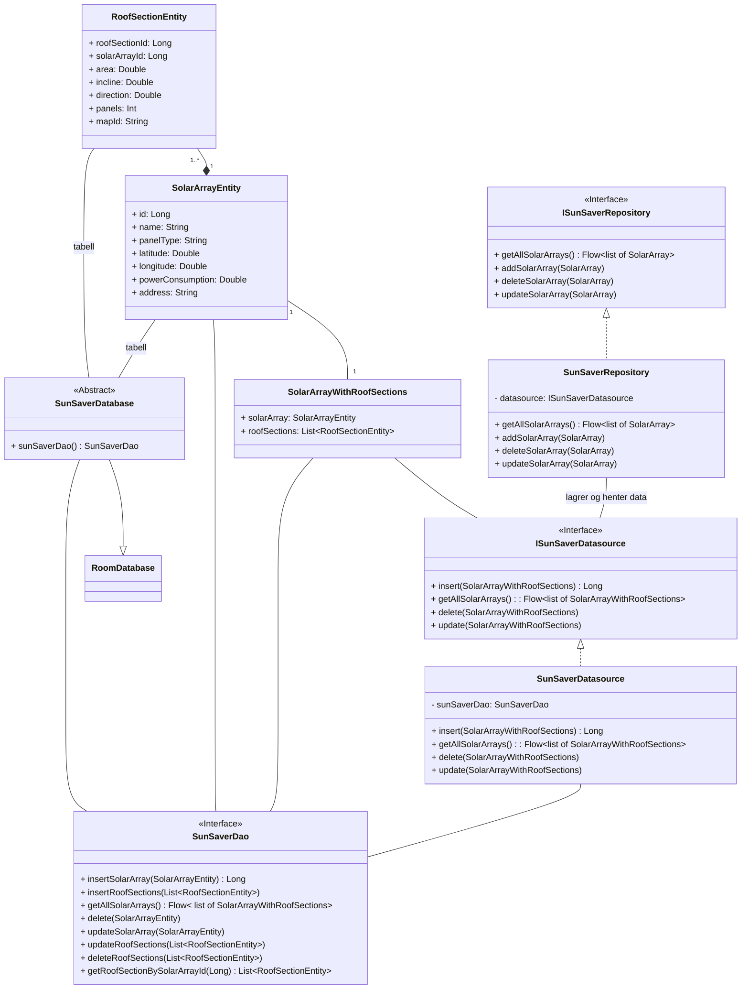

Assosiasjonen fra RoofSectionEntity til SolarArrayEntity er 1..* til 1, dvs. en RoofSectionEntity er innehold i nøyaktig ett SolarArrayEntity, og en SolarEntity må ha referanse til minst en takflate. På grunn av denne strenge relasjonen, vil vi ikke tegne flere linjer fra RoofSectionEntity til andre klasser, siden ingen klasser bruker kun RoofSectionEntity, og det underforstått at hvis en klasse refererer til SolarArrayEntity, så refererer den til en eller flere RoofSectionEntity. Dette valget er gjort for å forbedre leseligheten av diagrammet.