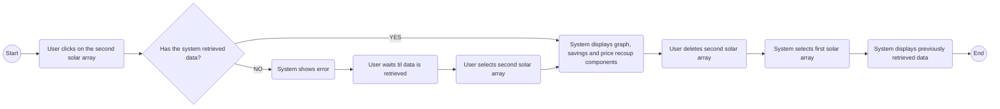
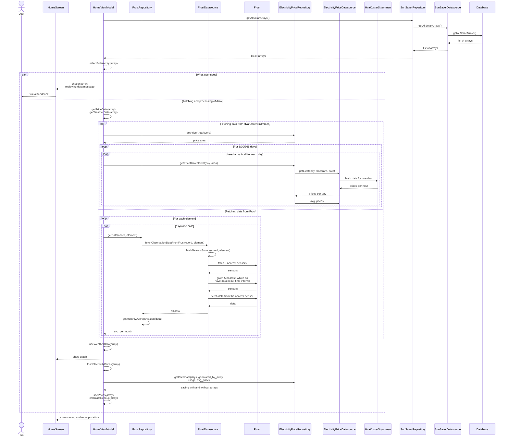
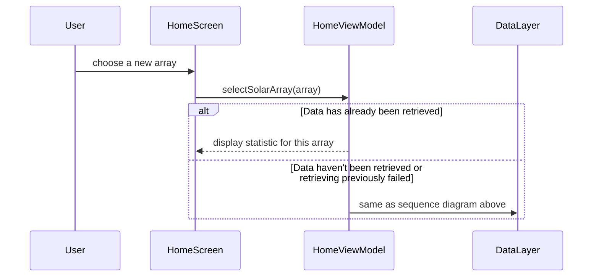
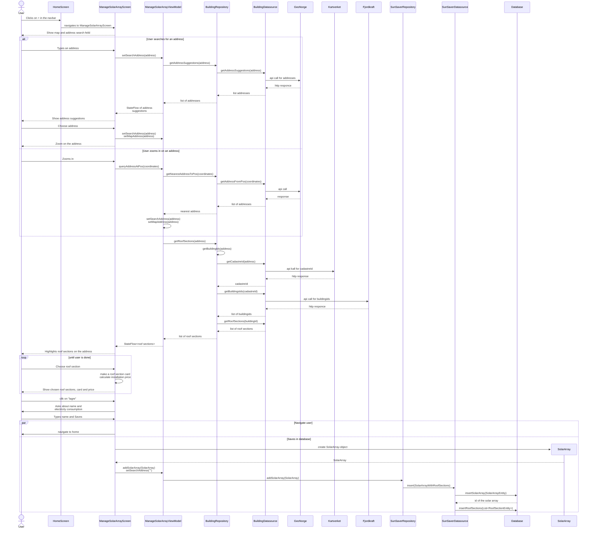
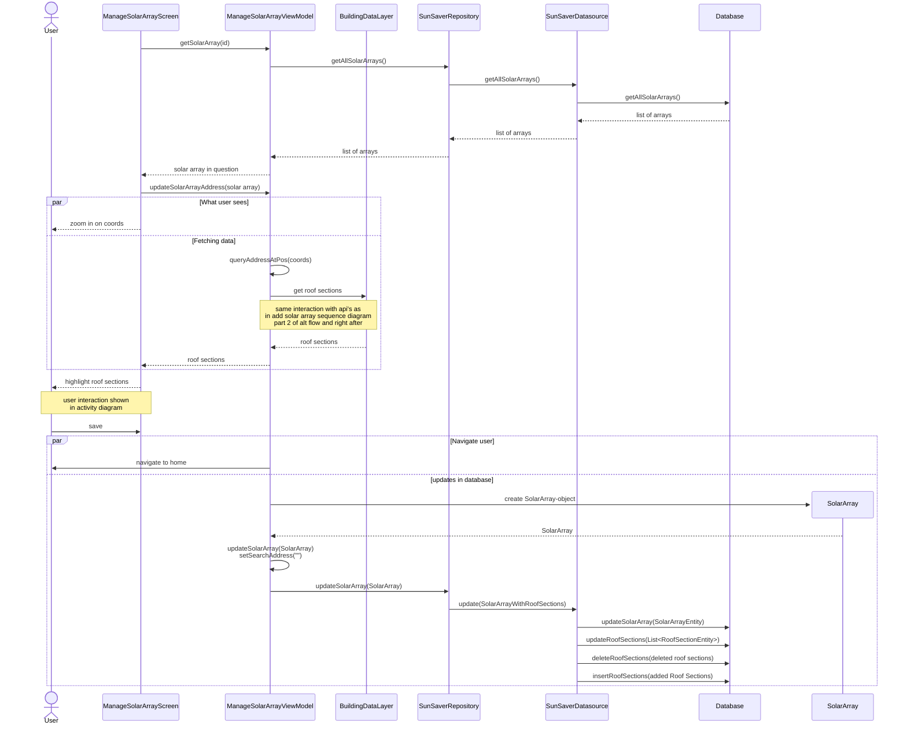
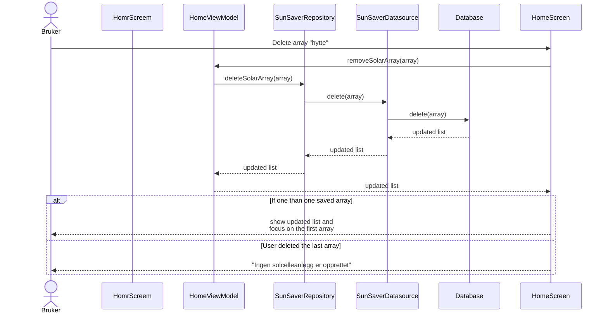

# Modellering
### Inkluderte diagrammer: 
- Use case diagram: Gir en generell oversikt over de viktigste funksjonene appen tilbyr brukeren. 
- Klassediagram: Viser appens struktur og klasser, og hvordan de er relatert til hverandre. 
- Sekvensdiagrammer: for utvalgte/hver use case viser hvordan de ulike komponentene (fra klassediagrammet) kommuniserer for å gjennomføre use caset. Den fokuserer primært på appens komponenter, og overlater brukerinteraksjonen til aktivitetsdiagrammet.
- Aktivitetsdiagrammet: målet med aktivitetsdiagrammet er å vise hvordan brukerne kan interagere med appen, og hva brukeren ser som resultat av interaksjon. Vi har valgt å ha to aktivitetsdiagrammer, den ene for hjemskjermen, og den andre for legg-til skjermen. 

## Use case diagram 
Formålet med appen er at bruker skal kunne legge til en eller flere solcelleanlegg, og administrere dem (altså slette og redigere). Appen har også en infoskjerm, men den er ikke en del av hovedfunksjonaliteten i appen, og dermed er den ikke inkludert i use case diagrammet.  

 

Med statistikk menes en estimat om hvor mye man sparer ved å installere dette solcelleanlegget, tid til man har tjent inn det man innvesterte inn i anlegget, og en graf som viser hvordan er strømproduksjonen i området mtp værforhold.  
Redigering, sletting og valg av nytt anlegg er markert med <<extend>> fordi de krever minst et lagret anlegg.  
 
Diagrammet ble laget ved hjelp av [app.diagrams.net](https://app.diagrams.net/) siden Mermaid ikke har Use case diagrammer.  

## Klassediagram
Klassediagrammet fokuserer på arkitekturen i appen vår (ViewModel - Repository - Datasource) og noen av de viktigste dataklassene. Vi inkluderer ikke composables siden de er strengt tatt funksjoner. 

```mermaid
classDiagram
    class SolarArray {
        + id: Long
        + name: String
        + panelType: SolarPanelType
        + roofSections: RoofSection
        + coordinates: Coordinates
        + powerConsumption: Double
        + address: String
    }

    class RoofSection {
        + id: Long?
        + area: Double
        + incline: Double
        + direction: Double
        + panels: Int
        + mapId: String?
    }
 
    %% HomeViewModel
    class NetworkObserver {
        + isConnected: Flow~Boolean~
        - connectivityManager: ConnectivityManager
        + isNetworkAvailable() Boolean
    }
        class Elements {
        <<Enumeration>>
        +TEMP
        + CLOUD
        + SNOW
        + IRRIDANCE
        + SUNHOURS
    }

    class HomeUiState {
        + solarArrays: List~SolarArray~ 
        + selectedSolarArray: SolarArray? 
        + priceData: PriceData 
        + electricityProductionData: Map~String, list of Double~
        + timeScope: TimeScope
        + timeUntilRecoup: Double 
    }

    class LoadingState {
        + isLoading: Boolean 
        + statusMessage: String
    }

    class TimeScope {
        <<Enumeration>>
            + DAY 
            + MONTH
            + YEAR
    }

    class HomeViewModel {
        - networkObserver: NetworkObserver
        - _repository: FrostRepository
        - _sunSaverRepository: SunSaverRepository
        - electricityPriceRepository: ElectricityPriceRepository

        - _priceLoadingState: MutableStateFlow~LoadingState~
        + priceLoadingState: StateFlow~LoadingState~

        - _graphLoadingState: MutableStateFlow~LoadingState~
        + graphLoadingState: StateFlow~LoadingState~

        - _homeUiState: MutableStateFlow~HomeUiState~
        + homeUiState: StateFlow~HomeUiState~

        - _snackbarMessage: MutableSharedFlow~String~
        + snackbarMessage: SharedFlow~String~

        - _isOnline: MutableStateFlow~Boolean~
        + isOnline: StateFlow~Boolean~

        - electricityProductionMap: MutableMap~SolarArray, list of Double~
        - electricityPriceMap: MutableMap~SolarArray, MutableMap of TimeScope and PriceData~
        - weatherDataMap: MutableMap~SolarArray, WeatherData~
        - priceDataMap: MutableMap~SolarArray, MutableMap of TimeScope and Double~
        - timeScopeToDays: Map~TimeScope, Int~

        + selectSolarArray(SolarArray, Boolean?)
        - observeNetwork()
        - getWeatherData(SolarArray)
        - useWeatherData(SolarArray)
        - getPriceData(SolarArray)
        + removeSolarArray(SolarArray)
        - loadElectricityPrices(SolarArray)
        - seePrices(TimeScope, SolarArray)
        + changeTimeScope(TimeScope)
        - calculateRecoup(SolarArray)
        - findUpdated(List~SolarArray~, List~SolarArray~) SolarArray?
    }
    
    %% Frost: Classes 
    class FrostRepository {
        - datasource: FrostDatasource
        + getData(Coordinates, Elements) Map~String, Double~
        - getMonthlyAverageValues(List~ObservationData~) Map~String, Double~
    }

    class FrostDatasource {
        - client: HttpClient
        - raw: String
        - encoded: String
        - authHeader: String
        - nameMap: Map~Elements, String~
        - sensorMap: MutableMap~Elements, mutable list of String~
        - referenceTome: String
        - fetchNearestSource(Coordinates, Elements) MutableMap~Elements, list of String~
        + fetchObservationDataFromFrost(Coordinates, Elements) List~ObservationData~
    } 

    class ObservationData {
        + sourceId: String
        + referenceTime: String
        + observations: List~Observation~
    }

    class Observation {
        + elementId: String
        + value: Double
        + unit: String
        + qualityCode: Double
    }
    
    %% ElectricityPrice
    class ElectricityPriceRepository {
        - datasource: ElectricityPriceDataSource
        + getPriceData(Int, Double, Double, Double) List~Double~
        + getMonth() Int
        + getPriceDataInterval(Int, String) List~Double~
        - decrementDate(String) String
        + getPriceAreal(Coordinates) String

    }
    class ElectricityPriceDataSource {
        - client: HttpClient
        + getElectricityPrices(String, String): List~ElectricityPriceInfo~
    }

    %% SunSaver
    class ISunSaverRepository {
        <<Interface>>
        + getAllSolarArrays() Flow~list of SolarArray~
        + addSolarArray(SolarArray)
        + deleteSolarArray(SolarArray)
        + updateSolarArray(SolarArray)
    }
    class SunSaverRepository {
        - datasource: ISunSaverDatasource
        + getAllSolarArrays() Flow~list of SolarArray~
        + addSolarArray(SolarArray)
        + deleteSolarArray(SolarArray)
        + updateSolarArray(SolarArray)
    }

    class SunSaverDatasource {
        - sunSaverDao: SunSaverDao 
        + insert(SolarArrayWithRoofSections) Long
        + getAllSolarArrays(): Flow~list of SolarArrayWithRoofSections~
        + delete(SolarArrayWithRoofSections)
        + update(SolarArrayWithRoofSections)
    }
    class ISunSaverDatasource {
        <<Interface>>
        + insert(SolarArrayWithRoofSections) Long
        + getAllSolarArrays(): Flow~list of SolarArrayWithRoofSections~
        + delete(SolarArrayWithRoofSections)
        + update(SolarArrayWithRoofSections)
    }    
    class SolarArrayWithRoofSections {
        + solarArray: SolarArrayEntity
        + roofSections: List~RoofSectionEntity~
    }

    %% Database part
    class SunSaverDao {
        <<Interface>>
        + insertSolarArray(SolarArrayEntity) Long
        + insertRoofSections(List~RoofSectionEntity~)
        + getAllSolarArrays() Flow~ list of SolarArrayWithRoofSections~
        + delete(SolarArrayEntity)
        + updateSolarArray(SolarArrayEntity)
        + updateRoofSections(List~RoofSectionEntity~)
        + deleteRoofSections(List~RoofSectionEntity~)
        + getRoofSectionBySolarArrayId(Long) List~RoofSectionEntity~
    }

    
    class SunSaverDatabase {
        <<Abstract>>
        + sunSaverDao() SunSaverDao
    }
    class RoomDatabase {
    }

 
    class SolarArrayEntity {
        + id: Long
        + name: String
        + panelType: String
        + latitude: Double
        + longitude: Double
        + powerConsumption: Double
        + address: String
    }
    class RoofSectionEntity {
        + roofSectionId: Long
        + solarArrayId: Long
        + area: Double
        + incline: Double
        + direction: Double
        + panels: Int
        + mapId: String
    }
    
    namespace Database {
        class SolarArrayEntity
        class RoofSectionEntity 
        class RoomDatabase
        class SunSaverDatabase
        class SunSaverDao
    }

    %% ViewModel TODO: Data classes here too
    class ManageSolarArrayViewModel {
        - repository: BuildingRepository
        - _sunSaverRepository: SunSaverRepository

        - _currentSolarArray: MutableStateFlow~SolarArray~
        + currentSolarArray: StateFlow~SolarArray~

        - _mapAddress: MutableStateFlow~AddressState~
        + mapAddress: StateFlow~AddressState~

        - _mapSearchAddress: MutableStateFlow~SearchAddressState~
        + mapAddress: StateFlow~SearchAddressState~
        
        + mapRoofSections: StateFlow~MapRoofSectionsState~
        + mapSearchAddressSuggestions: StateFlow~AddressSuggestionsState~
        
        + setMapAddress(Address)
        + setSearchAddress(String)
        + updateSolarArrayAddress(SolarArray?)
        + addSolarArray(SolarArray)
        + queryAddressAtPos(Pos)
        + updateSolarArray(SolarArray)
        + getSolarArray(Long)
        + resetUpdSolarArray()
    }

    %% Building 
    class BuildingRepository {
        - dataSource: BuildingDataSource
        + getAddressSuggestions(String) List~Address~
        + getNearestAddressToPos(Pos) Address? 
        + getRoofSections(Address) List~MapRoofSections~
        - getBuildingIds(Address) List~String~
    }

    class BuildingDataSource {
        - client: HttpClient
        + getAddressSuggestions(String) List~Address~
        + getAddressFromPos(Pos) List~Address~
        + getCadastreId(Address) Long? 
        + getBuildingIds(Long) List~String~
        + getRoofSections(String) List~MapRoofSections~
    }
    %% relations 

    RoofSection "1..*" --* "1" SolarArray : roofsections
    SolarArray -- HomeViewModel
    SolarArray -- ManageSolarArrayViewModel
    SolarArray -- ISunSaverRepository

    NetworkObserver -- HomeViewModel
    TimeScope -- HomeUiState
    HomeUiState -- HomeViewModel
    TimeScope -- HomeViewModel
    LoadingState -- HomeViewModel
    Elements -- HomeViewModel

    %% Frost 
    ObservationData -- Observation
    FrostRepository --> FrostDatasource: fetcher værdata (snø, skydekke, temperatur, flux, soltimer)
    HomeViewModel --> FrostRepository: fetcher gjennomsnittlige verdier av værdata
    Elements -- FrostRepository
    ObservationData -- FrostRepository
    ObservationData -- FrostDatasource 
    Elements -- FrostDatasource

    HomeViewModel --> ElectricityPriceRepository: gjennomsnittlig strømpris gitt tidsintervall
    ElectricityPriceRepository --> ElectricityPriceDataSource: fetcher NOK per kWn per dag

    %% db 
    
    ISunSaverRepository <|.. SunSaverRepository
    SunSaverRepository -- ISunSaverDatasource: lagrer og henter data
    
    ISunSaverDatasource <|.. SunSaverDatasource
    ISunSaverDatasource -- SolarArrayWithRoofSections
    SunSaverDatasource -- SunSaverDao
    SunSaverDatabase --|> RoomDatabase
    SunSaverDao -- SunSaverDatabase
    SolarArrayWithRoofSections -- SunSaverDao
    SunSaverDao -- SolarArrayEntity
    
    SunSaverDatabase -- RoofSectionEntity: tabell     
    SunSaverDatabase -- SolarArrayEntity: tabell

    
    SolarArrayEntity "1" *-- "1..*" RoofSectionEntity
    SolarArrayWithRoofSections "1" -- "1" SolarArrayEntity
    
    
    ManageSolarArrayViewModel -- ISunSaverRepository: lagrer og henter data
    HomeViewModel -- ISunSaverRepository: lagrer og henter data

    BuildingRepository --> BuildingDataSource: fetcher data om takflater, koordinater og adresser
    ManageSolarArrayViewModel --> BuildingRepository: fetcher adressedata med bygningsdata
```

### Kommentarer: 
- Siden Mermaid og markdown ikke støttet to <> inni hverandre, har jeg brukt "of" i disse tilfellene. For eksempel Flow&lt;list of SolarArray&gt;. 
- HomeViewModel ble veldig stor. Det er fordi den håndterer mye data, og har StateFlows (som i god praksis krever en privat mutable versjon og offentlig immutable)
- Om databasen: Vi lager en abstrakt klasse SunSaverDatabase som arver fra RoomDatabase, og Room-biblioteket fikser implementasjonen for oss. Vi inkluderte RoomDatabase for å vise arv, men den er tom siden den kommer fra Room-biblioteket. 
- SolarArray og SunSaverRepository: Siden det allerede er en assosiasjon mellom SolarArray og ISunSaverRepository, og SunSaverRepository implementerer dette interfacet, lager vi ikke en egen assosiasjon mellom SolarArray og SunSaverRepository, da dette er underforstått gjennom arv. Det samme gjelder for SolarArrayWithRoofSections og SunSaverDatasource.
- TODO: Må finne ut hvilke klasser skal inkluderes. 

## Aktivitetsdiagrammer
### **Name**: Create/edit a solar array
**Pre - conditions**: User has not created or edited a solar array before 
**Post - conditions**: User has created the solar array, it is saved in the homescreen and they are able to edit it.
 

**Main flow**: 
1. User opens the app
2. The system shows the homescreen 
3. User clicks on the pluss button 
4. The app shows a map and a dropdown menu
5. The user searches for an address 
6. The system navigates to that address in the graph
7. The system displays the available roof sections
8. The user clicks on their desired number of roof sections
9. The user drags up the drop - down menu
10. The user clicks on a roof section 
11. The user chooses not to edit the roof section 
12. The user selects a solar panel type 
13. The system shows a price overview
14. The user presses the save button
15. The user provides a name for the solar array
16. The user provides their electricity usage
17. The user saves the solar array
18. The system navigates back to the home screen.  
 

**Alternative flow**: 
3.1 The user clicks on the edit button on an existing solar array 
3.2 The system navigates to the edit screen 
3.3 The system zooms in on the address in the map  

4.1 The user navigates to their address on the map 
4.2 The user clicks on a house 
4.3 The system returns to step 7 

8.1 The user provides the required roof measurements (area, direction, angle and panels) 
8.2 The user adds the roof section 
8.3 The system returns to step 9 

10.1 The user chooses what to edit  
10.2 The user edits the chosen element  
10.3 The user saves their edited roof section 
10.4 The system returns to step 12 
 

```mermaid
flowchart LR;
    Start((Start))

    HomeScreen(Shows homescreen)
    PlusButton(Create new solar array)
    MapAndDropdown(Shows a map and a drop-down menu)
    Search{Search address or navigate on map?}

    EditOrCreate{Create a new solar array or edit an existing one?}
    EditSolarArray(User clicks on edit button)
    AddressZoom(System zooms in on address in the map)

    ClickAddress(Select a house on the map)
    ShowRoofSections(Show available roof sections)
    ChooseRoofSections(Add desired roof sections)
    AddRoofManually{Add from map or add manually?}

    AddArea(Write area)
    AddDirection(Write direction)
    AddAngle(Write angle)
    AddPanels(Write number of panels)

    ClickRoofSection(Click on chosen roof section)
    EditRoofSection{Edit roof section?}
    ChooseEditSegment{Choose editing segment}

    Edit(Edit)
    SaveChanges(Save)

    SelectSolarPanel{Select a solar panel type}
    ShowPriceOverview(Show price overview)

    SelectSaveButton(Press save button)
    WriteName(Write solar array name)
    WriteElectricity(Write electricity usage)
    Save(Save)

    SavedHomeScreen(Shows homescreen with saved solar array)

    Start --> HomeScreen
    HomeScreen --> EditOrCreate
    EditOrCreate --Create--> PlusButton
    EditOrCreate --Edit--> EditSolarArray

    PlusButton --> MapAndDropdown
    MapAndDropdown --> Search 

    EditSolarArray --> AddressZoom 
    AddressZoom --> ShowRoofSections 

    Search --Navigate on map--> ClickAddress --> ShowRoofSections 
    Search --Search on searchfield --> ShowRoofSections

    ShowRoofSections --> ChooseRoofSections 
    ChooseRoofSections --> AddRoofManually

    AddRoofManually --From map--> ClickRoofSection
    AddRoofManually --Manually-->AddArea

    AddArea --> AddDirection
    AddDirection --> AddAngle
    AddAngle --> AddPanels
    AddPanels --> ClickRoofSection

    ClickRoofSection --> EditRoofSection
    EditRoofSection --YES--> ChooseEditSegment
    EditRoofSection --NO--> SelectSolarPanel

    ChooseEditSegment --Area--> Edit
    ChooseEditSegment --Direction-->  Edit
    ChooseEditSegment --Angle-->  Edit
    ChooseEditSegment --Panels-->  Edit

    Edit --> SaveChanges
    SaveChanges --> SelectSolarPanel
    SelectSolarPanel --PREMIUM--> ShowPriceOverview
    SelectSolarPanel --ECONOMY--> ShowPriceOverview
    SelectSolarPanel --PERFORMANCE--> ShowPriceOverview


    ShowPriceOverview --> SelectSaveButton
    SelectSaveButton --> WriteName
    WriteName --> WriteElectricity
    WriteElectricity --> Save
    Save --> SavedHomeScreen

    End((End))

    SavedHomeScreen --> End

```

### **Name**: Navigating between solar arrays and deleting them
**Pre - conditions**: User opens the app to the homescreen with two existing solar arrays  
**Post - conditions**: User has successfully navigated between the solar arrays and deleted one. 

**Main flow**: 
1. User clicks on the second solar array 
2. System retrieves data for the second solar array
3. System displays the graph, savings and price recoup components for second solar array 
4. User deletes the first solar array
5. System navigates user back to the first solar array
6. System displays the previously retrieved data 
 

**Alternative flow**: 
1.1 System has not yet retrieved data for the first solar array 
1.2 System shows an error and prevents user from navigating to the second solar array. 
1.3 User waits for data be retrieved 
1.4 System retrieves data 
1.5 User clicks on second solar array 
1.6 System returns to step 2 

## Sekvensdiagram: Se statistikk for lagret anlegg
Bemerkning: dette er et use case i seg selv, men dette kan også sees på som en del av de andre use casene (opprett, rediger og slett). Det som er forskjellen på de ulike casene er hvilket solcelleanlegg som er i fokus. For å unngå copy-paste, vil de referere til dette diagrammet med kommentar om hvilket solcelleanlegg det hentes data for. Et av punktene i "Forenklinger/kommentarer" under diagrammet gir også en full oversikt over de ulike scenarioene. 

### Tekstlig beskrivelse: 
Navn: Se statistikk for lagret anlegg 
Aktør: Bruker 
Prebetingelse: Bruker har minst et lagret anlegg. Bruker går inn på appen.  
Postbetingelse: Bruker fikk sett statistikk for sin anlegg.  
1. Appen henter lagrede anlegg fra databasen og viser dem på HomeScreen. 
2. Appen setter i fokus et av anleggene. 
3. Appen viser viser til brukeren at data lastes. 
4. Samtidig gjøres det asykrone kall til HvaKosterStrømmen og Frost for å hente gjennomsnittlige verdier per måned. 
5. Når data fra Frost er hentet, beregnes forventet gjennomsnittlig strømproduksjonen per måned. 
6. Resultatet vises til brukeren.
7. Etter det beregnes forventet sparing og inntjenningstid. 
8. Resulatet av det vises også til brukeren. 

### Forenklinger/Kommentarer
- Hvilket anlegg som settes i fokus, avhenger av hvilken use case det er snakk om. Hvis appen er nettopp åpnet (og brukeren har noen anlegg lagret) så vil det første anlegget settes i fokus. Hvis vi ble nettopp navigert til hjemskjermen etter å ha lagt til et nytt anlegg, så blir det nye anlegget satt i fokus. Hvis man ble navigert til hjemskjermen etter å ha oppdatert et anlegg, så vil det oppdaterte anlegget være i fokus. Hvis et anlegg blir sletta, retter vi fokus til det første anlegget (hvis det finnes)
- Bruker "coord" for "coordinater" for å spare litt plass
- Grunnen til at vi har mange api kall per tidsenhet til HvaKosterStrømmen er at apiet bare har en json fil for hver dag som finnes, så må man gjøre et api call per dag for å hente ut flere dager. Altså itererer loopen gjennom hver dag vi trenger å hente strømdata for, og henter strømpriser med et api-kall for hver dag. Dette blir mange kall, så noen dager blir hoppet over. Når dataen/prisene er hentet, legges det til i en liste, slik at etter loopen er ferdig, kan sitte igjen med en gjennomsnittsverdi av strømprisen for de dagene vi har hentet for.
- Siden Frost ikke alltid har data som vi trenger (se rapport 3.2 API), så måtte vi finne en løsning på dette. Løsningen vi fikk for, var at for hver element (værkategori), finner vi først 5 nærmeste sensorer, og så sjekker vi, hvilke av de sensorene har data i den tidsperioden vi ønsker. Hvis det er flere enn en (1) sensor, bruker vi den nærmeste sensoren for å hente data i denne værkategorien. 
- Siden diagrammet er komplisert og vi ønsker å gjenbruke det i andre use case, er alternativt flyt ikke inkludert. 

## Sekvensdiagram: Velg et anlegg for å se statistikk for det. 

### Tekstlig beskrivelse
1. Bruker velger et annet anlegg 
2. Appen viser data 

Alternativt flyt: Dette anlegget har allerede vært i fokus siden appen ble åpnet (eller det skjedde feil ved tidligere henting av data).  

2. Appen henter data som i sekvensdiagrammet ovenfor. 

### Kommentarer: 
- Kan sees som et fortsettelse av sekvensdiagrammet for "Se statistikk for lagret anlegg" med et alternativt flyt. 
- Hovedmålet med diagrammet er å vise at data ikke må hentes på nytt, hvis forrige henting var vellykket. 

## Sekvensdiagram: Legg til solcelleanlegg

### Tekstlig beskrivelse: 
Navn: Legg til et anlegg 
Aktør: Bruker 
Pre: Brukeren har trykket på +-tegnet nede i navbaren og er nå dirigert til ManageSolarArrayScreen.  
Post: Solcelleanlegget er lagret i databasen og vises på hjemskjermen.  

1. Bruker trykker på +-tegnet nede for å legge til nytt solcelleanlegg. 
2. Bruker blir navigert til ManageSolarArrayScreen. 
3. Bruker skriver inn en adresse. 
4. Appen gjør et kall mot GeoNorge for å hente adresseforslag. 
5. Bruker velger noe fra forslagene. 
6. Brukeren blir zoomet inn på stedet. 
7. Appen gjør et kall mot Kartverket for å få cadastreId. 
8. Appen gjør et kall mot Fjordkraft for å hente takflater. 
9. Appen markerer takflater på skjermen. 
10. Bruker velger et takflate. 
11. Appen lagrer takflate som kort. Regner ut installasjonsprisen. Viser til brukeren.
12. Bruker trykker på lagre. 
13. Appen ber om å oppgi navn på anlegger og strømforbruk. 
14. Bruker skriver inn navn 
15. Bruker trykker på lagre. 
16. Appen lagrer til databasen og navigerer til HomeScreen. 

  **Alternativ flyt**: Brukeren velger å zoome inn på adressen manuelt. 

3. Bruker zoomer inn på riktig adresse.  
4. Appen gjør et kall mot GeoNorge for å hente adressen.  
5. Hopp til punkt 7.  

### Forenklinger/Kommentarer
- Vi starter interaksjon med at brukeren er nettopp blitt navigert til ManageSolarArrayScreen.
- Vi sier at adresseforslag hentes kun en gang selv de egentlig hentes for hver bokstav som skriver/slettes i søkefeltet. 
- Utelatter å forklare alle steg i "appen gjør"-punktene, siden de kan sees i detalj på sekvensdiagrammet. 
- Valideringer/div. brukerinteraksjon etter at adressen er satt skal vises i aktivitetsdiagrammet. Dette er fordi det er lite givende å ha det i sekvensdigrammet, da det er kun interaksjon mellom bruker og ManageSolarArrayScreen-skjermen. 
- Etter at det nye anlegget er lagret, vil appen hente data for dette nye anlegget. Så videre på hjemskjermen får vi samme flyt som i sekvensdiagrammet for "Se statistikk for lagret anlegg" med det nye anlegget i fokus. 

## Sekvensdiagram: Redigere solcelleanlegg

### Tekstlig beskrivelse: 
Navn: Redigere eksisterende anlegg  
Aktør: Bruker 
Pre: Bruker har minst ett lagret anlegg. Brukeren har trykket på redigeringsikonet og blitt navigert til ny skjerm  
Post: Det aktuelle anlegget er oppdatert 
1. Appen henter solcelleanlegget som skal redigeres vha dets id. 
2. Appen zoomer inn på koordinter samtidig som adresse og takflater hentes. 
3. Bruker manipulerer takflater. 
4. Bruker trykker på lagre. 
5. Appen navigerer brukeren til hjemskjermen og oppdaterer array. 

### Forenklinger/Kommentarer
- Med tanke på appens bruksområde, vil det være et fåtall anlegg lagret, så det er ikke så stor overheng å hente alle lagrede anlegg.
- For å gjøre diagrammet mindre, dropppet vi noen av de delene som var vist i forrige diagrammer. 
- Etter at brukeren er navigert til hjemskjermen, er det oppdaterte anlegget i fokus. Ingen data hentes (da adressen forblir den samme), men beregninger kjøres på nytt med oppdatert data. 

## Sekvensdiagram: Slette solcelleanlegg

### Tekstlig beskrivelse:  
Navn: Slett et anlegg 
Aktør: Bruker 
Pre: Bruker har minst en (1) solcelleanlegg lagret.  
Post: Den aktuelle solcelleanlegget er slettet.  
Hovedflyt:
1. Bruker klikker på søppelkasse ikonet et lagret solcelleanlegg. 
2. Anlegget slettes fra databasen. 
3. På grunn av Flow blir hjemsiden oppdatert slik at anlegget forsvinner fra lista over lagrede anlegg. 
4. Viser data for det første anlegget som er lagret. 

 Alternativ flyt: Bruker sletter siste anlegg 

4. Viser meldingen "Ingen solcelleanlegg er opprettet"
