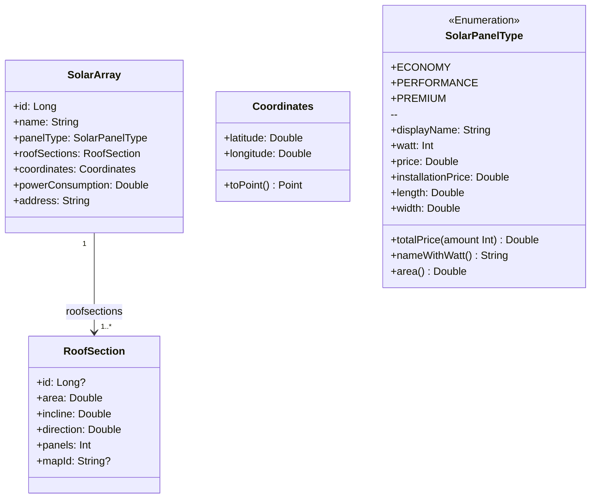

# Modellering
### Inkluderte diagrammer: 
- Use case diagram: Gir en oversikt over de viktigste funksjonene 
i appen sett fra brukerens perspektiv, og hvilke handlinger brukeren kan utføre.
- Klassediagram: viser hvilke klasser og datamodeller, og hvordan de henger sammen.
- Sekvensdiagrammer: for utvalgte/hver use case viser hvordan de ulike komponentene 
(fra klassediagrammet) kommuniserer sammen for å utføre use caset
- Aktivitetsdiagrammet: for utvalgte/hver use case viser hvordan interaksjonen 
ser ut fra brukerens perspektiv 

## Use case diagram 

Diagrammet ble laget ved hjelp av [app.diagrams.net](https://app.diagrams.net/) 
siden Mermaid ikke tilbyr Use case diagrammer.  

## Klassediagram

