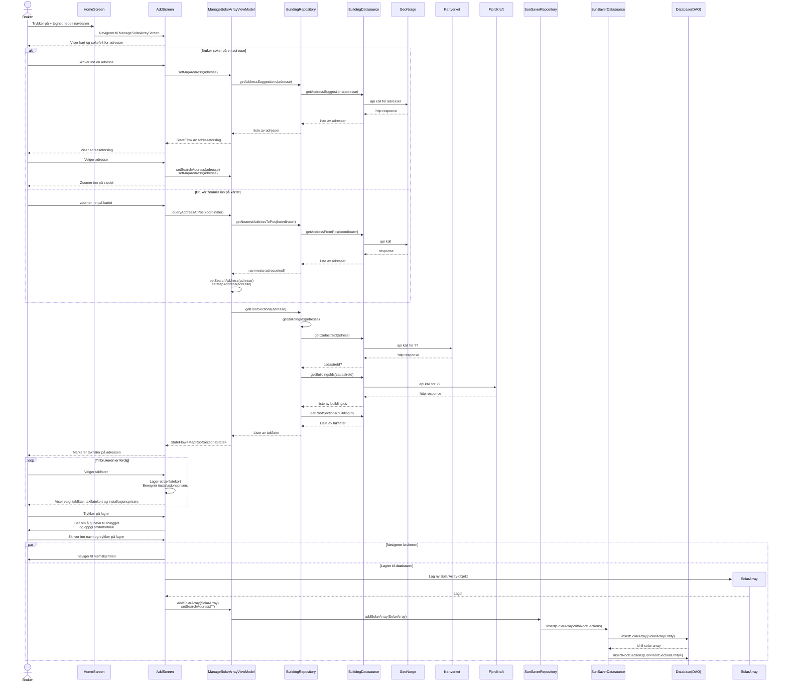
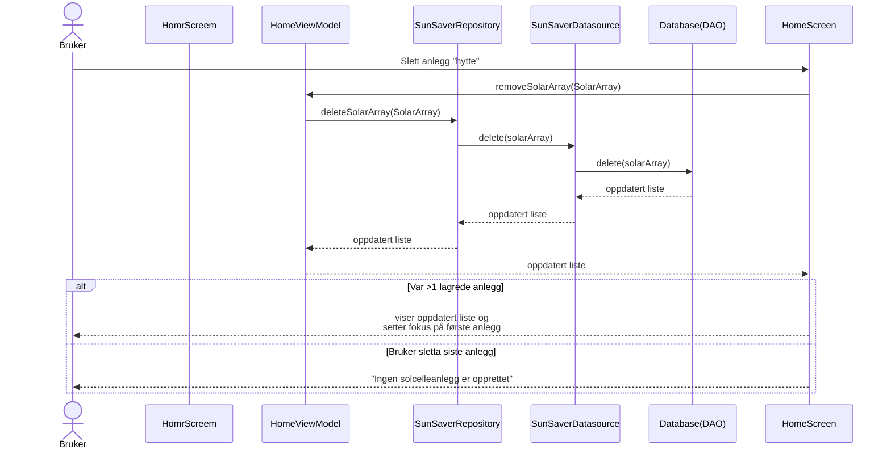

# Modellering
### Inkluderte diagrammer: 
- Use case diagram: Gir en generell oversikt over de viktigste funksjonene appen tilbyr brukeren. 
- Klassediagram: Viser appens struktur og klasser, og hvordan de er relatert til hverandre. 
- Sekvensdiagrammer: for utvalgte/hver use case viser hvordan de ulike komponentene (fra klassediagrammet) kommuniserer for å gjennomføre use caset. Den fokuserer primært på appens komponenter, og overlater brukerinteraksjonen til aktivitetsdiagrammet. 
- Aktivitetsdiagrammet: for utvalgte/hver use case viser mulige scenarioer til hvordan bruker kan interagere med appen. Vi lager aktivitetsdiagrammer kun for de use casene der brukeren må foreta noen valg, f.eks. "lagre et anlegg" og "redigere et anlegg". 

## Use case diagram 
Formålet med appen er at bruker skal kunne legge til en eller flere solcelleanlegg, og administrere dem (altså slette og redigere). Appen har også en infoskjerm, men den er ikke en del av hovedfunksjonaliteten i appen, og dermed er den ikke inkludert i use case diagrammet.  

 

\* estimat om hvor mye man sparer ved å installere dette solcelleanlegget, tid til man har tjent inn det man innvesterte inn i anlegget, og en graf som viser hvordan er strømproduksjonen i området mtp værforhold.  
Redigering, sletting og valg av nytt anlegg er markert med <<extend>> fordi de krever minst et lagret anlegg.  
 
Diagrammet ble laget ved hjelp av [app.diagrams.net](https://app.diagrams.net/) siden Mermaid ikke har Use case diagrammer.  

## Klassediagram
Klassediagrammet fokuserer på arkitekturen i appen vår (ViewModel - Repository - Datasource) og noen av de viktigste dataklasser. Vi inkluderer ikke composables siden de er strengt tatt funksjoner. 

Kommentarer: 
- Siden Mermaid og markdown ikke støttet to <> inni hverandre, har jeg brukt "of" i disse tilfellene. For eksempel Flow&lt;list of SolarArray&gt;. 
- HomeViewModel ble veldig stor. Det er fordi den håndterer mye data, og har StateFlows (som i god praksis krever en privat mutable versjon og offentlig immutable)
- Om databasen: Vi lager en abstrakt klasse SunSaverDatabase som arver fra RoomDatabase, og Room-biblioteket fikser implementasjonen for oss. Vi inkluderte RoomDatabase for å vise arv, men den er tom siden den kommer fra Room-biblioteket. 
- SolarArray og SunSaverRepository: Siden det allerede er en assosiasjon mellom SolarArray og ISunSaverRepository, og SunSaverRepository implementerer dette interfacet, lager vi ikke en egen assosiasjon mellom SolarArray og SunSaverRepository, da dette er underforstått gjennom arv. Det samme gjelder for SolarArrayWithRoofSections og SunSaverDatasource.
- TODO: Må finne ut hvilke klasser skal inkluderes. 

## Use case: Legg til solcelleanlegg
Sekvensdiagrammet under arbeid. Må også ha en aktivitetdiagram her.  
Aktivitetsdiagram skal inneholde hvordan interaksjonen ser ut fra brukerens perspektiv. Den skal f.eks. inkludere validering av brukerinput, som ikke blir inkludert i sekvensdiagrammet for å gjøre sekvensdiagrammet mer arkitekturnært, mens aktivitetsdiagrammet skal være mer brukerinteraksjonsnært. Aktivitetsdiagrammet for use case "lagre ny" bør herved inneholde (i tillegg til resten av brukerinteraksjon i sekvensdiagrammet): 
validering av om brukeren har fylt ut alle felt; hendelsesforløp der bruker ønsker å endre (f.eks.) antall paneler i et valgt takflate; bruker bytter type på solcellepaneller

### Tekstlig beskrivelse: 
Pre: Brukeren har trykket på +-tegnet nede i navbaren og er nå dirigert til ManageSolarArrayScreen.  
Post: Solcelleanlegget er lagret i databasen og vises på hjemskjermen.  

1. Bruker trykker på +-tegnet nede for å legge til nytt solcelleanlegg. 
2. Bruker blir navigert til ManageSolarArrayScreen. 
3. Bruker skriver inn en adresse. 
4. Appen gjør et kall mot GeoNorge for å hente adresseforslag. 
5. Bruker velger noe fra forslagene. 
6. Appen gjør et nytt kall mot GeoNorge for å hente hele adressen. (????)
7. Brukeren blir zoomet inn på stedet. 
8. Appen gjør et kall mot Kartverket for å få cadastreId. 
9. Appen gjør et kall mot Fjordkraft for å hente takflater. 
10. Appen markerer takflater på skjermen. 
11. Bruker velger et takflate. 
12. Appen lagrer takflate som kort. Regner ut installasjonsprisen. Viser til brukeren.
13. Bruker trykker på lagre. 
14. Appen ber om å oppgi navn på anlegger og strømforbruk. 
15. Bruker skriver inn navn 
16. Bruker trykker på lagre. 
17. Appen lagrer til databasen og navigerer til HomeScreen. 

  **Alternativ flyt**: Brukeren velger å zoome inn på adressen manuelt. 

3. Bruker zoomer inn på riktig adresse.  
4. Appen gjør et kall mot GeoNorge for å hente adressen. (???)  
5. Hopp til punkt 8.  

#### Forenklinger/Kommentarer
- Vi starter interaksjon med at brukeren er nettopp blitt navigert til ManageSolarArrayScreen.
- Vi sier at adresseforslag hentes kun en gang selv de egentlig hentes for hver bokstav som skriver/slettes i søkefeltet. 
- Utelatter å forklare alle steg i "appen gjør"-punktene, siden de kan sees i detalj på sekvensdiagrammet. 
- Valideringer/div. brukerinteraksjon etter at adressen er satt skal vises i aktivitetsdiagrammet. Dette er fordi det er lite givende å ha det i sekvensdigrammet, da det er kun interaksjon mellom bruker og ManageSolarArrayScreen-skjermen. 
- Etter at det nye anlegget er lagret, vil databasen automatisk sende ut en oppdatert liste (på grunn av Flow) som HomeScreen vil fange opp. Da vil HomeScreen sette det nye solcelleanlegget i fokus og hente data for den. Dette utelatter vi fra sekvensdiagrammet for å minke kompleksiteten. 

## Use case: Se lagrede solcelleanlegg med data + Velge et anlegg for å se tilhørende data
Sekvensdiagram. Kan ha en aktivitetsdiagram hvor man trykker på ting på skjermen, men strengt tatt ikke nødvendig.  
Velge et anlegg for å se tilhørende data: 
Mulig kan (og bør) kombineres med "Se lagrede solcelleanlegg med data". Kan ha en liten aktivitetsdiagram som viser at man kan ikke velge før data er lastet (men er kanskje ikke nødvendig)

## Use case: Redigere solcelleanlegg
Sekvensdiagram og aktivitetsdiagram. 

## Use case: Slette solcelleanlegg
Vi gir også brukeren mulighet til å slette solcelleanlegg. For dette use caset har vi kun sekvensdiagram fordi å slette et anlegg tar kun ett klikk. 

Tekstlig beskrivelse:  
Pre: Bruker har minst en (1) solcelleanlegg lagret.  
Post: Den aktuelle solcelleanlegget er slettet.  
Hovedflyt:
1. Bruker klikker på søppelkasse ikonet et lagret solcelleanlegg. 
2. Anlegget slettes fra databasen. 
3. På grunn av Flow blir hjemsiden oppdatert slik at anlegget forsvinner fra lista over lagrede anlegg. 
4. Viser data for det første anlegget som er lagret. 

 Alternativ flyt: Bruker sletter siste anlegg 

4. Viser meldingen "Ingen solcelleanlegg er opprettet"
