# Modellering
### Inkluderte diagrammer: 
- Use case diagram: Gir en oversikt over de viktigste funksjonene 
i appen sett fra brukerens perspektiv, og hvilke handlinger brukeren kan utføre.
- Klassediagram: viser hvilke klasser og datamodeller, og hvordan de henger sammen.
- Sekvensdiagrammer: for utvalgte/hver use case viser hvordan de ulike komponentene 
(fra klassediagrammet) kommuniserer sammen for å utføre use caset
- Aktivitetsdiagrammet: for utvalgte/hver use case viser hvordan interaksjonen 
ser ut fra brukerens perspektiv 

## Use case diagram 

Diagrammet ble laget ved hjelp av [app.diagrams.net](https://app.diagrams.net/) 
siden Mermaid ikke tilbyr Use case diagrammer.  
TODO: babling om de ulike funksjonalitetene her 

## Klassediagram
Formålet med klassediagrammet er å vise strukturen i prosjektet vårt.

```mermaid
classDiagram
    class SolarArray {
        + id: Long
        + name: String
        + panelType: SolarPanelType
        + roofSections: RoofSection
        + coordinates: Coordinates
        + powerConsumption: Double
        + address: String
    }

    class RoofSection {
        + id: Long?
        + area: Double
        + incline: Double
        + direction: Double
        + panels: Int
        + mapId: String?
    }
    RoofSection "1.." --* "1*" SolarArray : roofsections
    SolarArray -- HomeViewModel
    SolarArray -- ISunSaverRepository
    SolarArray -- ManageSolarArrayViewModel
 
    class NetworkObserver {
        + isConnected: Flow~Boolean~
        - connectivityManager: ConnectivityManager
        + isNetworkAvailable() Boolean
    }
    
    NetworkObserver -- HomeViewModel
    %% LOTS of data classes??? TODO
    class HomeViewModel {
        - networkObserver: NetworkObserver
        - _repository: FrostRepository
        - _sunSaverRepository: SunSaverRepository
        - electricityPriceRepository: ElectricityPriceRepository

        - _priceLoadingState: MutableStateFlow~LoadingState~
        + priceLoadingState: StateFlow~LoadingState~

        - _graphLoadingState: MutableStateFlow~LoadingState~
        + graphLoadingState: StateFlow~LoadingState~

        - _homeUiState: MutableStateFlow~HomeUiState~
        + homeUiState: StateFlow~HomeUiState~

        - _snackbarMessage: MutableSharedFlow~String~
        + snackbarMessage: SharedFlow~String~

        - _isOnline: MutableStateFlow~Boolean~
        + isOnline: StateFlow~Boolean~

        - electricityProductionMap: MutableMap~SolarArray, list of Double~
        - electricityPriceMap: MutableMap~SolarArray, MutableMap of TimeScope and PriceData~
        - weatherDataMap: MutableMap~SolarArray, WeatherData~
        - priceDataMap: MutableMap~SolarArray, MutableMap of TimeScope and Double~
        - timeScopeToDays: Map~TimeScope, Int~

        + selectSolarArray(SolarArray, Boolean?)
        - observeNetwork()
        - getWeatherData(SolarArray)
        - useWeatherData(SolarArray)
        - getPriceData(SolarArray)
        + removeSolarArray(SolarArray)
        - loadElectricityPrices(SolarArray)
        - seePrices(TimeScope, SolarArray)
        + changeTimeScope(TimeScope)
        - calculateRecoup(SolarArray)
        - findUpdated(List~SolarArray~, List~SolarArray~) SolarArray?
    }
    
    %% Frost: Classes 
    class FrostRepository {
        - datasource: FrostDatasource
        + getData(Coordinates, Elements) Map~String, Double~
        - getMonthlyAverageValues(List~ObservationData~) Map~String, Double~
    }

    class FrostDataSource {
        - client: HttpClient
        - raw: String
        - encoded: String
        - authHeader: String
        - nameMap: Map~Elements, String~
        - sensorMap: MutableMap~Elements, mutable list of String~
        - referenceTome: String
        - fetchNearestSource(Coordinates, Elements) MutableMap~Elements, list of String~
        + fetchObservationDataFromFrost(Coordinates, Elements) List~ObservationData~
    }

    FrostRepository --> FrostDataSource: fetcher værdata (snø, skydekke, temperatur, flux, soltimer)
    HomeViewModel --> FrostRepository: fetcher gjennomsnittlige verdier av værdata


    %% ElectricityPrice
    class ElectricityPriceRepository {
        - datasource: ElectricityPriceDataSource
        + getPriceData(Int, Double, Double, Double) List~Double~
        + getMonth() Int
        + getPriceDataInterval(Int, String) List~Double~
        - decrementDate(String) String
        + getPriceAreal(Coordinates) String

    }
    class ElectricityPriceDataSource {
        - client: HttpClient
        + getElectricityPrices(String, String): List~ElectricityPriceInfo~
    }
    
    ElectricityPriceRepository --> ElectricityPriceDataSource: fetcher NOK per kWn per dag
    HomeViewModel --> ElectricityPriceRepository: gjennomsnittlig strømpris gitt tidsintervall

    %% ViewModel TODO: Data classes here too
    class ManageSolarArrayViewModel {
        - repository: BuildingRepository
        - _sunSaverRepository: SunSaverRepository

        - _currentSolarArray: MutableStateFlow~SolarArray~
        + currentSolarArray: StateFlow~SolarArray~

        - _mapAddress: MutableStateFlow~AddressState~
        + mapAddress: StateFlow~AddressState~

        - _mapSearchAddress: MutableStateFlow~SearchAddressState~
        + mapAddress: StateFlow~SearchAddressState~
        
        + mapRoofSections: StateFlow~MapRoofSectionsState~
        + mapSearchAddressSuggestions: StateFlow~AddressSuggestionsState~
        
        + setMapAddress(Address)
        + setSearchAddress(String)
        + updateSolarArrayAddress(SolarArray?)
        + addSolarArray(SolarArray)
        + queryAddressAtPos(Pos)
        + updateSolarArray(SolarArray)
        + getSolarArray(Long)
        + resetUpdSolarArray()
    }

     %% SunSaver
    class ISunSaverRepository {
        <<Interface>>
        + getAllSolarArrays() Flow~list of SolarArray~
        + addSolarArray(SolarArray)
        + deleteSolarArray(SolarArray)
        + updateSolarArray(SolarArray)
    }
    class SunSaverRepository {
        - datasource: ISunSaverDatasource
        + getAllSolarArrays() Flow~list of SolarArray~
        + addSolarArray(SolarArray)
        + deleteSolarArray(SolarArray)
        + updateSolarArray(SolarArray)
    }
    ISunSaverRepository <|.. SunSaverRepository
    SunSaverRepository -- ISunSaverDatasource: lagrer og henter data
    
    class SunSaverDatasource {
        - sunSaverDao: SunSaverDao 
        + insert(SolarArrayWithRoofSections) Long
        + getAllSolarArrays(): Flow~list of SolarArrayWithRoofSections~
        + delete(SolarArrayWithRoofSections)
        + update(SolarArrayWithRoofSections)
    }
    class ISunSaverDatasource {
        <<Interface>>
        + insert(SolarArrayWithRoofSections) Long
        + getAllSolarArrays(): Flow~list of SolarArrayWithRoofSections~
        + delete(SolarArrayWithRoofSections)
        + update(SolarArrayWithRoofSections)
    }
    ISunSaverDatasource <|.. SunSaverDatasource
    SolarArrayWithRoofSections -- ISunSaverDatasource 
    %% Database part
    class SunSaverDao {
        <<Interface>>
        + insertSolarArray(SolarArrayEntity) Long
        + insertRoofSections(List~RoofSectionEntity~)
        + getAllSolarArrays() Flow~ list of SolarArrayWithRoofSections~
        + delete(SolarArrayEntity)
        + updateSolarArray(SolarArrayEntity)
        + updateRoofSections(List~RoofSectionEntity~)
        + deleteRoofSections(List~RoofSectionEntity~)
        + getRoofSectionBySolarArrayId(Long) List~RoofSectionEntity~
    }

    SunSaverDatasource -- SunSaverDao
    
    class SunSaverDatabase {
        <<Abstract>>
        + sunSaverDao() SunSaverDao
    }
    class RoomDatabase {
    }
    SunSaverDatabase --|> RoomDatabase

    class SolarArrayWithRoofSections {
        + solarArray: SolarArrayEntity
        + roofSections: List~RoofSectionEntity~
    }
    class SolarArrayEntity {
        + id: Long
        + name: String
        + panelType: String
        + latitude: Double
        + longitude: Double
        + powerConsumption: Double
        + address: String
    }
    class RoofSectionEntity {
        + roofSectionId: Long
        + solarArrayId: Long
        + area: Double
        + incline: Double
        + direction: Double
        + panels: Int
        + mapId: String
    }
    
    
    SunSaverDao -- SunSaverDatabase
    SolarArrayWithRoofSections -- SunSaverDao
    SunSaverDao -- SolarArrayEntity
    

    SunSaverDatabase -- SolarArrayEntity: tabell
    SunSaverDatabase -- RoofSectionEntity: tabell     
    
    RoofSectionEntity "1..*" --* "1" SolarArrayEntity
    SolarArrayEntity "1" -- "1" SolarArrayWithRoofSections
    
    
    ManageSolarArrayViewModel -- ISunSaverRepository: lagrer og henter data
    HomeViewModel -- ISunSaverRepository: lagrer og henter data

    %% Building 
    class BuildingRepository {
        - dataSource: BuildingDataSource
        + getAddressSuggestions(String) List~Address~
        + getNearestAddressToPos(Pos) Address? 
        + getRoofSections(Address) List~MapRoofSections~
        - getBuildingIds(Address) List~String~
    }

    class BuildingDataSource {
        - client: HttpClient
        + getAddressSuggestions(String) List~Address~
        + getAddressFromPos(Pos) List~Address~
        + getCadastreId(Address) Long? 
        + getBuildingIds(Long) List~String~
        + getRoofSections(String) List~MapRoofSections~
    }
    BuildingRepository --> BuildingDataSource: fetcher data om takflater, koordinater og adresser
    ManageSolarArrayViewModel --> BuildingRepository: fetcher adressedata med bygningsdata

    %% should also include database's implementation somehow 
    %% probably just include abstract class sunSaverDatabase with its entities and dao
```

Kommentarer: 
- Siden Mermaid og markdown ikke støttet to <> inni hverandre, har jeg brukt "of" i disse tilfellene. For eksempel Flow&lt;list of SolarArray&gt;. 
- HomeViewModel ble veldig stor. Det er fordi den håndterer mye data, og har StateFlows (som i god praksis krever en privat mutable versjon og offentlig immutable)
- Om databasen: Vi lager en abstrakt klasse SunSaverDatabase som arver fra RoomDatabase, og Room-biblioteket fikser implementasjonen for oss. Vi inkluderte RoomDatabase for å vise arv, men den er tom siden den kommer fra Room-biblioteket. 
- SSolarArray og SunSaverRepository: Siden det allerede er en assosiasjon mellom SolarArray og ISunSaverRepository, og SunSaverRepository implementerer dette interfacet, lager vi ikke en egen assosiasjon mellom SolarArray og SunSaverRepository, da dette er underforstått gjennom arv.
Det samme gjelder for SolarArrayWithRoofSections og SunSaverDatasource.
