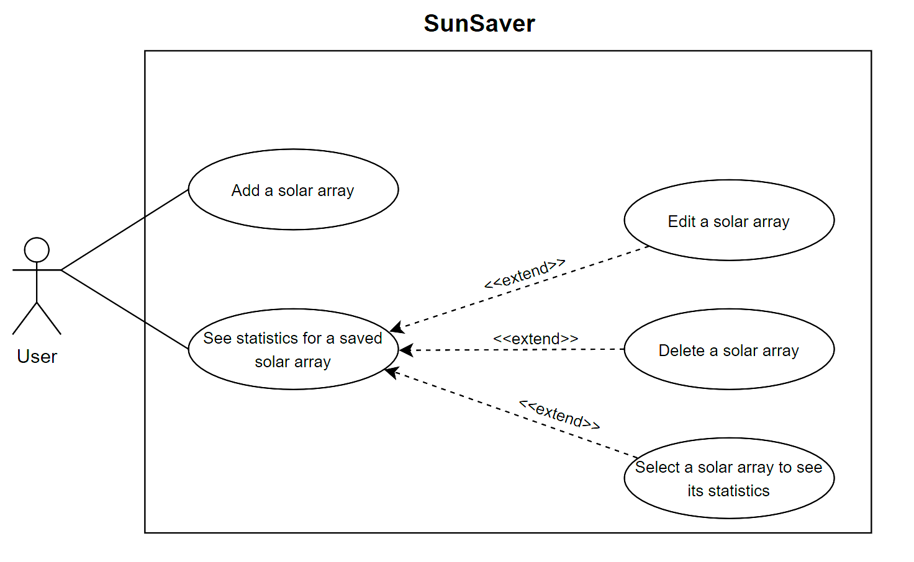
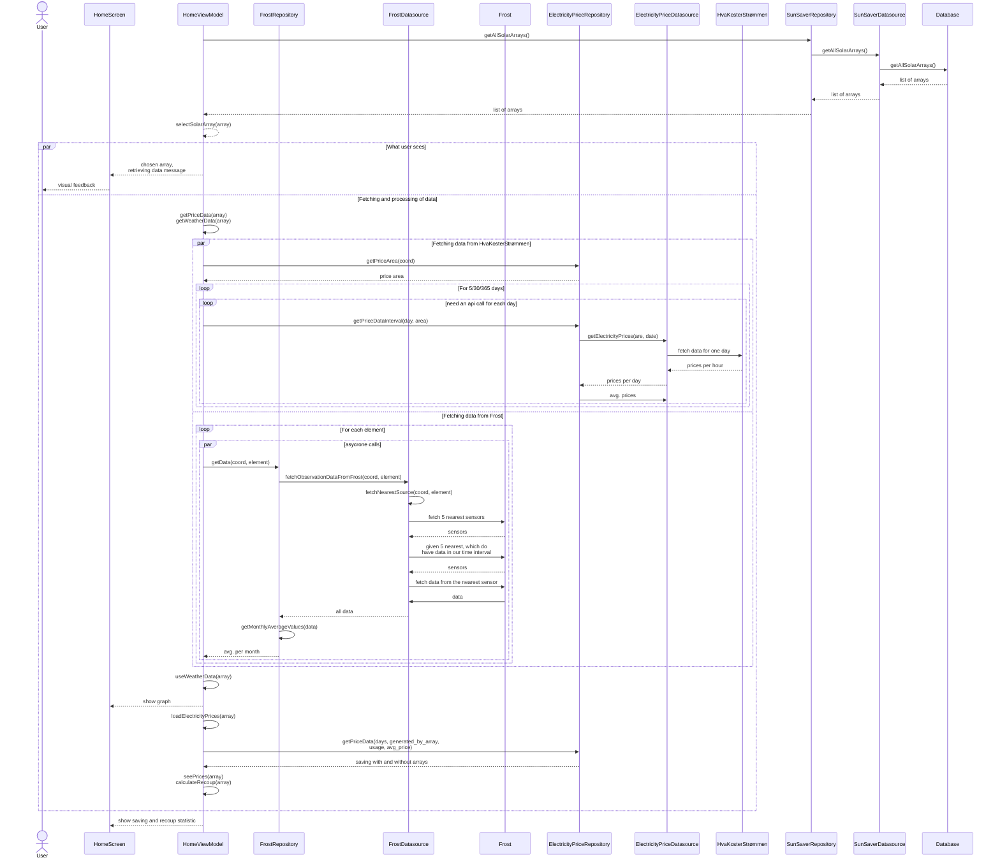
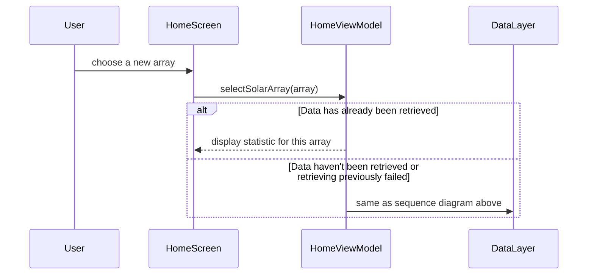
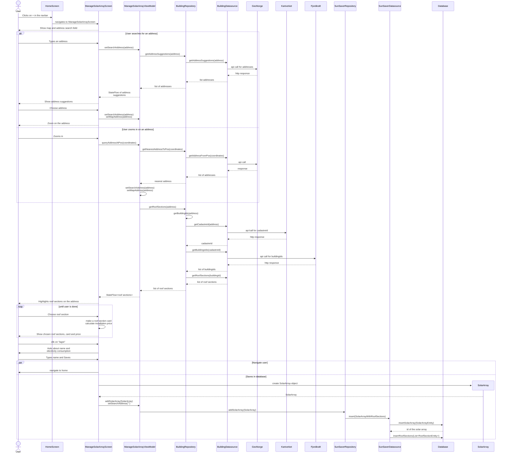
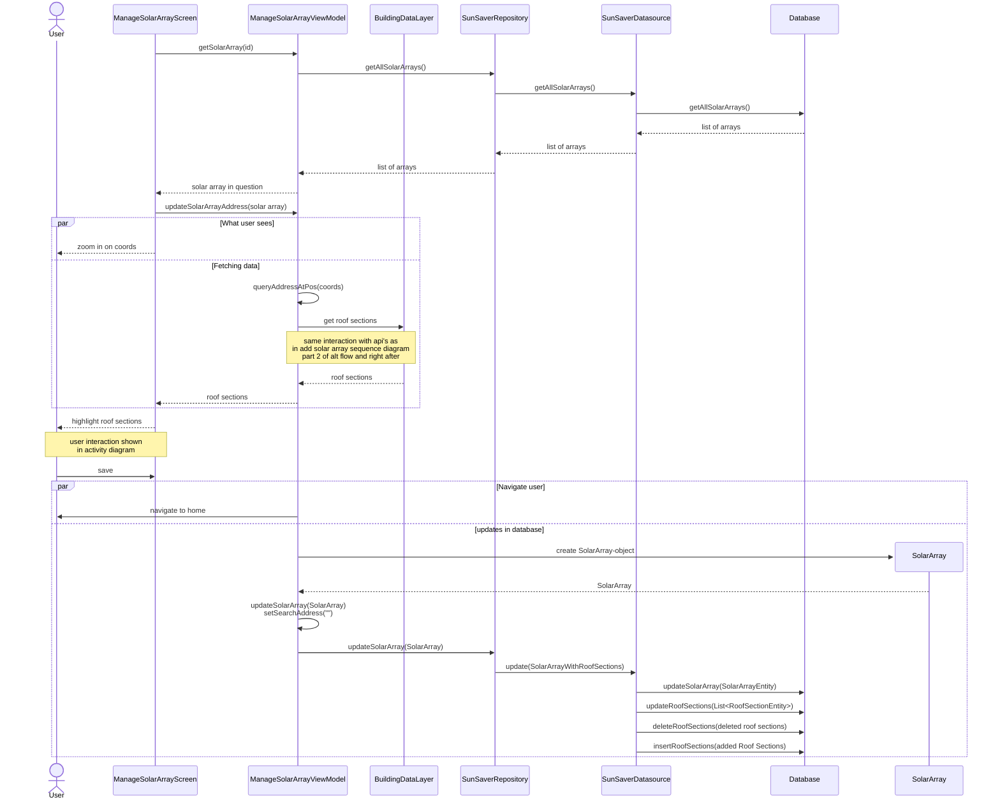
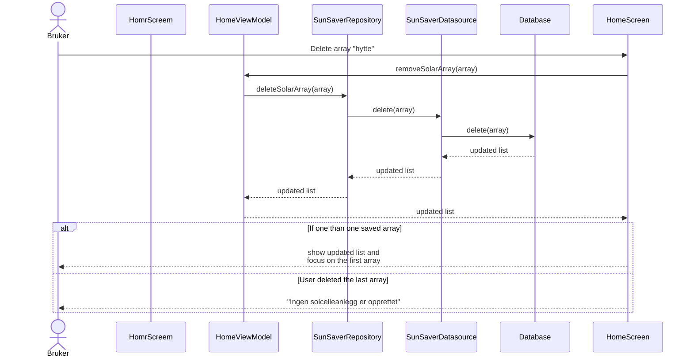
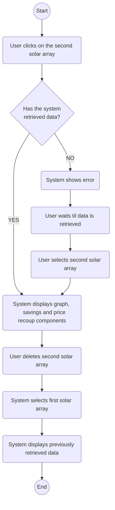

# Modelling 
### Included Diagrams : 
- Use case diagram: Provides a general overview of the most important functions our app provides to the user.
- Class diagram: Shows the app's structure, classes and how they are related to each other.
- Sequence diagrams: for each use case, shows how the different components (from the class diagram) communicate with each other to implement that use case. It focuses primarily on the app's components, leaving user interaction to the activity diagram.
- Activity diagrams: The goal of the activity diagram is to showcase how users can interact with the app, and what they see as a result of that interaction. We have chosen to have two activity diagrams, one for the home screen, and the other for the ManageSolarArray screen. These are attached at the end of the file.

## Use case diagram 
The purpose of the app is for the user to be able to add one or more solar array, and manage them (i.e. delete and edit). The app also has an info screen, but it is not part of the main functionality of the app, and thus it is not included in the use case diagram.  

 

Statistics refer to three things: an estimate of how much you save by installing the chosen solar array, the time it takes to earn back what you have invested in the system, and a graph that shows an overview of electricity production in the area of the solar array based on weather conditions.  
Editing, deleting and selecting a new solar array are marked with <<extend>> because they require at least one stored solar array. 
 
The diagram was made with the help of [app.diagrams.net](https://app.diagrams.net/) because Mermaid does not provide functionality to model Use case diagrams.  

## Class Diagram
The class diagram focuses on our apps architecture  (Viewmodel - Repositoty - Datasource) and some of the most important data classes. We do not include composables since they are strictly functions.

```mermaid
classDiagram

    class Coordinates {
        + latitude: Double
        + longitude: Double
        + toPoint() Point
    }
    note for Coordinates "Also used in Frost Data Layer, ElectricityPriceRepository <br/> and Pos. Relations not included for better readablity"

    class SolarPanelType {
        <<Enumeration>>
        + displayName: String
        + watt: Int
        - price: Double
        - installationPrice: Double
        + length: Double
        + width: Double
        + totalPrice(Int) Double
        + nameWithWatt() String
        + area() Double
    }
    note for SolarPanelType "Economy<br/>Performance<br/>Premium"

    class SolarArray {
        + id: Long
        + name: String
        + panelType: SolarPanelType
        + roofSections: RoofSection
        + coordinates: Coordinates
        + powerConsumption: Double
        + address: String
    }

    class RoofSection {
        + id: Long?
        + area: Double
        + incline: Double
        + direction: Double
        + panels: Int
        + mapId: String?
    }
 
    %% HomeViewModel
    class NetworkObserver {
        + isConnected: Flow~Boolean~
        - connectivityManager: ConnectivityManager
        + isNetworkAvailable() Boolean
    }
    
    class Elements {
        <<Enumeration>>
        +TEMP
        + CLOUD
        + SNOW
        + IRRIDANCE
        + SUNHOURS
    }

    class HomeUiState {
        + solarArrays: List~SolarArray~ 
        + selectedSolarArray: SolarArray? 
        + priceData: PriceData 
        + electricityProductionData: Map~String, list of Double~
        + timeScope: TimeScope
        + timeUntilRecoup: Double 
    }

    class LoadingState {
        + isLoading: Boolean 
        + statusMessage: String
    }

    class TimeScope {
        <<Enumeration>>
        + DAY 
        + MONTH
        + YEAR
    }

    class PriceData {
        + realPrice: Double
        + solarPrice: Double
        + saved: Double
    }

    class WeatherData {
        + temp: Map~String, Double~
        + cloud: Map~String, Double~
        + snow: Map~String, Double~
        + irradiance: Map~String, Double~
        + sunhours: Map~String, Double~ 
    }

    class HomeViewModel {
        - networkObserver: NetworkObserver
        - _repository: FrostRepository
        - _sunSaverRepository: SunSaverRepository
        - electricityPriceRepository: ElectricityPriceRepository

        - _priceLoadingState: MutableStateFlow~LoadingState~
        + priceLoadingState: StateFlow~LoadingState~

        - _graphLoadingState: MutableStateFlow~LoadingState~
        + graphLoadingState: StateFlow~LoadingState~

        - _homeUiState: MutableStateFlow~HomeUiState~
        + homeUiState: StateFlow~HomeUiState~

        - _snackbarMessage: MutableSharedFlow~String~
        + snackbarMessage: SharedFlow~String~

        - _isOnline: MutableStateFlow~Boolean~
        + isOnline: StateFlow~Boolean~

        - electricityProductionMap: MutableMap~SolarArray, list of Double~
        - electricityPriceMap: MutableMap~SolarArray, MutableMap of TimeScope and PriceData~
        - weatherDataMap: MutableMap~SolarArray, WeatherData~
        - priceDataMap: MutableMap~SolarArray, MutableMap of TimeScope and Double~
        - timeScopeToDays: Map~TimeScope, Int~

        + selectSolarArray(SolarArray, Boolean?)
        - observeNetwork()
        - getWeatherData(SolarArray)
        - useWeatherData(SolarArray)
        - getPriceData(SolarArray)
        + removeSolarArray(SolarArray)
        - loadElectricityPrices(SolarArray)
        - seePrices(TimeScope, SolarArray)
        + changeTimeScope(TimeScope)
        - calculateRecoup(SolarArray)
        - findUpdated(List~SolarArray~, List~SolarArray~) SolarArray?
    }
    
    %% Frost: Classes 
    class FrostRepository {
        - datasource: FrostDatasource
        + getData(Coordinates, Elements) Map~String, Double~
        - getMonthlyAverageValues(List~ObservationData~) Map~String, Double~
    }

    class FrostDatasource {
        - client: HttpClient
        - raw: String
        - encoded: String
        - authHeader: String
        - nameMap: Map~Elements, String~
        - sensorMap: MutableMap~Elements, mutable list of String~
        - referenceTome: String
        - fetchNearestSource(Coordinates, Elements) MutableMap~Elements, list of String~
        + fetchObservationDataFromFrost(Coordinates, Elements) List~ObservationData~
    } 

    class ObservationData {
        + sourceId: String
        + referenceTime: String
        + observations: List~Observation~
    }

    class Observation {
        + elementId: String
        + value: Double
        + unit: String
        + qualityCode: Double
    }

    class AvailableObservation {
        + sourceId: String
        + validFrom: String
        + timeOffset: String
        + timeResolution: String
        + timeSeriesId: Int
        + elementId: String
        + unit: String
    }

    class SensorSystem {
        + id: String
        + name: String
        + shortName: String
        + geometry: SystemGeometry
        + distance: Double
        + validFrom: String
    }

    class SystemGeometry {
        + coordinates: List~Double~
        + nearest: Boolean
    }

    %% ElectricityPrice
    class ElectricityPriceRepository {
        - datasource: ElectricityPriceDataSource
        + getPriceData(Int, Double, Double, Double) List~Double~
        + getMonth() Int
        + getPriceDataInterval(Int, String) List~Double~
        - decrementDate(String) String
        + getPriceAreal(Coordinates) String

    }
    
    class ElectricityPriceDataSource {
        - client: HttpClient
        + getElectricityPrices(String, String) List~ElectricityPriceInfo~
    }

    class ElectricityPriceInfo {
        + nokPrKiloWh: Double
        + eurPrKiloWh: Double
        + exchangeRate: Double
        + timeStart: String
        + timeEnd: String
    }
    

    %% SunSaver
    class ISunSaverRepository {
        <<Interface>>
        + getAllSolarArrays() Flow~list of SolarArray~
        + addSolarArray(SolarArray)
        + deleteSolarArray(SolarArray)
        + updateSolarArray(SolarArray)
    }
    class SunSaverRepository {
        - datasource: ISunSaverDatasource
        + getAllSolarArrays() Flow~list of SolarArray~
        + addSolarArray(SolarArray)
        + deleteSolarArray(SolarArray)
        + updateSolarArray(SolarArray)
    }

    class SunSaverDatasource {
        - sunSaverDao: SunSaverDao 
        + insert(SolarArrayWithRoofSections) Long
        + getAllSolarArrays(): Flow~list of SolarArrayWithRoofSections~
        + delete(SolarArrayWithRoofSections)
        + update(SolarArrayWithRoofSections)
    }
    class ISunSaverDatasource {
        <<Interface>>
        + insert(SolarArrayWithRoofSections) Long
        + getAllSolarArrays(): Flow~list of SolarArrayWithRoofSections~
        + delete(SolarArrayWithRoofSections)
        + update(SolarArrayWithRoofSections)
    }    
    class SolarArrayWithRoofSections {
        + solarArray: SolarArrayEntity
        + roofSections: List~RoofSectionEntity~
    }

    %% Database part
    class SunSaverDao {
        <<Interface>>
        + insertSolarArray(SolarArrayEntity) Long
        + insertRoofSections(List~RoofSectionEntity~)
        + getAllSolarArrays() Flow~ list of SolarArrayWithRoofSections~
        + delete(SolarArrayEntity)
        + updateSolarArray(SolarArrayEntity)
        + updateRoofSections(List~RoofSectionEntity~)
        + deleteRoofSections(List~RoofSectionEntity~)
        + getRoofSectionBySolarArrayId(Long) List~RoofSectionEntity~
    }

    
    class SunSaverDatabase {
        <<Abstract>>
        + sunSaverDao() SunSaverDao
    }
    class RoomDatabase {
    }

 
    class SolarArrayEntity {
        + id: Long
        + name: String
        + panelType: String
        + latitude: Double
        + longitude: Double
        + powerConsumption: Double
        + address: String
    }
    class RoofSectionEntity {
        + roofSectionId: Long
        + solarArrayId: Long
        + area: Double
        + incline: Double
        + direction: Double
        + panels: Int
        + mapId: String
    }
    
    namespace Database {
        class SolarArrayEntity
        class RoofSectionEntity 
        class RoomDatabase
        class SunSaverDatabase
        class SunSaverDao
    }

    
    class MapRoofSection {
        + id: String
        + incline: Double
        + direction: Double
        + length: Double
        + width: Double
        + geometry: RoofSectionGeometry
        + latitude: Double
        + longitude: Double
    }

    class RoofSectionGeometry {
        + coordinates: List~list of list of Double~
        + contains(Point) Boolean
        + toPoints() List~Point~
    }

    class Pos {
        + lat: Double
        + lon: Double
        + toPoint() Point 
        + toCoordinates() Coordinates 
        + fromPoint(Point) Pos 
    }

    class Address {
        + address: String
        + area: String
        + areaCode: String
        + pos: Pos
        + cadastralNumber: Int
        + propertyNumber: Int
        + communityNumber: String
        + distanceFromPoint: Double
        + toFormatted() String 
    }

    class AddressState {
        + address: Address
    }
    
    class MapRoofSectionsState {
        + roofSections: List~MapRoofSection~
        + isError: Boolean
    }

    class SearchAddressState {
        + query: String
    }

    class AddressSuggestionsState {
        + suggestions: List~Address~
    }

    class ManageSolarArrayViewModel {
        - repository: BuildingRepository
        - _sunSaverRepository: SunSaverRepository

        - _currentSolarArray: MutableStateFlow~SolarArray~
        + currentSolarArray: StateFlow~SolarArray~

        - _mapAddress: MutableStateFlow~AddressState~
        + mapAddress: StateFlow~AddressState~

        - _mapSearchAddress: MutableStateFlow~SearchAddressState~
        + mapAddress: StateFlow~SearchAddressState~
        
        + mapRoofSections: StateFlow~MapRoofSectionsState~
        + mapSearchAddressSuggestions: StateFlow~AddressSuggestionsState~
        
        + setMapAddress(Address)
        + setSearchAddress(String)
        + updateSolarArrayAddress(SolarArray?)
        + addSolarArray(SolarArray)
        + queryAddressAtPos(Pos)
        + updateSolarArray(SolarArray)
        + getSolarArray(Long)
        + resetUpdSolarArray()
    }

    %% Building 
    class BuildingRepository {
        - dataSource: BuildingDataSource
        + getAddressSuggestions(String) List~Address~
        + getNearestAddressToPos(Pos) Address? 
        + getRoofSections(Address) List~MapRoofSections~
        - getBuildingIds(Address) List~String~
    }

    class BuildingDataSource {
        - client: HttpClient
        + getAddressSuggestions(String) List~Address~
        + getAddressFromPos(Pos) List~Address~
        + getCadastreId(Address) Long? 
        + getBuildingIds(Long) List~String~
        + getRoofSections(String) List~MapRoofSections~
    }
    %% relations 

    %% data classes
    SolarPanelType "1" -- SolarArray
    RoofSection "1..*" --* "1" SolarArray
    Coordinates "1" -- SolarArray
    SolarArray -- HomeViewModel
    SolarArray -- ISunSaverRepository
    SolarArray -- ManageSolarArrayViewModel

    TimeScope -- HomeUiState
    HomeUiState -- HomeViewModel: ui
    
    TimeScope -- HomeViewModel: ui
    PriceData -- HomeViewModel: ui
    WeatherData -- HomeViewModel: ui
    LoadingState -- HomeViewModel: ui 
    NetworkObserver -- HomeViewModel
    HomeViewModel -- Elements
    
    %% Frost 
    ObservationData "1" *-- "1..*" Observation
    FrostRepository --> "1" FrostDatasource: fetch weather data (show, sky coverage, <br/>temperature, flux, sun hours)
    HomeViewModel --> "1" FrostRepository: get avg weather values

    FrostRepository -- Elements
    FrostRepository -- ObservationData: serialized data
 
    FrostDatasource -- Elements
    FrostDatasource -- AvailableObservation: serialization
    FrostDatasource -- SensorSystem: serialization
    SensorSystem *-- "1" SystemGeometry
    
    FrostDatasource -- ObservationData: serialization

    %% electricity prices
    HomeViewModel --> ElectricityPriceRepository: get avg. electricity prise 
    ElectricityPriceRepository --> ElectricityPriceDataSource: fetch NOK per kWn per day
    
    %% ElectricityPriceInfo -- ElectricityPriceRepository
    ElectricityPriceDataSource -- ElectricityPriceInfo: serialization
    
    %% db 
    ISunSaverRepository <|.. SunSaverRepository
    SunSaverRepository -- ISunSaverDatasource: save or get data
    
    ISunSaverDatasource <|.. SunSaverDatasource
    ISunSaverDatasource -- SolarArrayWithRoofSections
    SunSaverDatasource -- SunSaverDao
    SunSaverDatabase --|> RoomDatabase
    SunSaverDao -- SunSaverDatabase
    SolarArrayWithRoofSections -- SunSaverDao
    SunSaverDao -- SolarArrayEntity
    
    SunSaverDatabase -- RoofSectionEntity: table
    SunSaverDatabase -- SolarArrayEntity: table

    SolarArrayEntity "1" *-- "1..*" RoofSectionEntity
    SolarArrayWithRoofSections "1" -- "1" SolarArrayEntity
    
    ManageSolarArrayViewModel -- ISunSaverRepository: save or get data
    HomeViewModel -- ISunSaverRepository: save or get data

    %% manage solar array
    SearchAddressState -- ManageSolarArrayViewModel: ui
   
    ManageSolarArrayViewModel -- AddressState: ui
    ManageSolarArrayViewModel -- AddressSuggestionsState: ui
    ManageSolarArrayViewModel -- MapRoofSectionsState: ui
    
    BuildingDataSource -- MapRoofSection: serialization
    BuildingRepository -- MapRoofSection 
    ManageSolarArrayViewModel -- MapRoofSection 

    MapRoofSectionsState -- "*" MapRoofSection
    AddressState -- "1" Address
    AddressSuggestionsState -- "*" Address

    ManageSolarArrayViewModel --> BuildingRepository: fetch address and building data
    BuildingRepository --> BuildingDataSource: fetch data about roof sections, <br/>coords and address

    MapRoofSection *-- "1" RoofSectionGeometry
    Address -- "1" Pos
    ManageSolarArrayViewModel -- Pos
    BuildingRepository -- Pos
    BuildingDataSource -- Pos: serialization

    ManageSolarArrayViewModel -- Address
    BuildingRepository -- Address
    BuildingDataSource -- Address: serialization
```

### Comments:
- The class diagram does not include the data classes that are only used to store the API reponses
- We chose not to show the relationships between Coordinates, FrostRepository, FrostDatasource, ElectricityRepository, and Pos. We made this decision as a trade-off between completeness and readability. Including all of these connections would have made the diagram appear cluttered, which would reduce its clarity.
- SolarArrayType: : In Kotlin, enum classes can contain fields and functions, which is not typically supported by standard UML enum representations. Therefore, we chose to model it as a class with fields and methods, and included the enum values ​​as a note.
- Data classes are red. You cannot see this Github due to Github's limitation but it can be viewed using VSCode's preview button.
- Since Mermaid and markdown did not support two <> inside each other, we have used "of" in these cases. For example Flow&lt;list of SolarArray&gt;.
- SolarArray and SunSaverRepository: Since there is already an association between SolarArray and ISunSaverRepository, and SunSaverRepository implements this interface, we do not create a separate association between SolarArray and SunSaverRepository, as this is implied by inheritance. The same applies to SolarArrayWithRoofSections and SunSaverDatasource.

## Sequence Diagram: View the statistics for a saved solar array.
Note: This is a use case in itself, but it can also be seen as part of the other use cases (create, edit and delete). The difference between the use cases is the solar array that is in focus. To avoid repetition, they (the sequence diagrams for the other use cases) will refer to this diagram with a comment about which solar array the data is being retrieved for. The section, "Simplifications/Comments" situated below the diagram also provides an overview of the different scenarios.

### Textual Description: 
**Name**: View statistics for a saved solar array 
**Actor**: User 
**Precondition**: User has at least one saved solar array. User enters the app.  
**Postcondition**: User has seen statistics for their solar array.  
**Main Flow**:
1. The app retrieves saved solar arrays from the database and displays them on the HomeScreen.
2. The app focuses on one of the solar arrays.
3. The app shows the user that data is being loaded.
4. At the same time, asynchronous calls are made to HvaKosterStrømmen and Frost to retrieve average values ​​per month.
5. When data from Frost has been retrieved, the expected average electricity production per month is calculated.
6. The result is shown to the user.
7. After that, the expected savings and payback period are calculated.
8. The result is also shown to the user.

### Simplifications/Comments
- Which solar array is set in focus depends on the use case. If the app has just been opened (and the user has some solar arrays saved) then the first solar array will be set in focus. If we were just navigated to the home screen after adding a new solar array, then the new solar array will be set in focus. If we were navigated to the home screen after updating a solar array, then the updated solar array will be in focus. If a solar array is deleted, we direct focus to the first solar array (if it exists)
- We have used "coord" as a simplification for "coordinates" to save some space
- The reason we have many API calls per time unit to HvaKosterStrømmen is that the API only has one json file for each day that exists, so you have to make multiple API calls to retrieve data for multiple days. The loop iterates through each day we need to get electricity data for and retrieves electricity prices for that day with an API call. This will be a lot of API calls, so some days will be skipped. When the data/prices are fetched they are added to a list and when the loop is finished we are left with an average value of the electricity price for the days we have retrieved data for.
- Since Frost did not always have the data that we needed (see report 3.2 API), we had to find a workaround. Our solution was that for each element (in the weather category), we first find the five closest sensors, and then we check which of those sensors have data in the time period we want. If there is more than one sensor, we use the closest sensor to retrieve data in that weather category.
- Since the diagram is complicated and we want to reuse it in other use cases, alternative flow is not included.

## Sequence Diagram: Select a solar array to see its statistics 

### Textual description
**Main Flow**:
1. User selects another solar array
2. App displays data

**Alternative flow**: This solar array has already been in focus since the app was opened (or an error occurred during previous data retrieval).  

2. App retrieves data as in the sequence diagram above.
### Comments: 
- Can be seen as a continuation of the "View statistics for a saved solar array" sequence diagram with an alternative flow.
- The main goal of the diagram is to show that data does not need to be retrieved again, if the previous retrieval was successful.

## Sequence Diagrarm: Add a solar array 

### Textual description: 
**Name**: Add a solar array 
**Actor**: User 
**Precondition**: The user has pressed the + sign at the bottom of the navbar and is now directed to ManageSolarArrayScreen.  
**Postcondition**: The solar array is saved in the database and displayed on the home screen.  
**Main flow**: 
1. User presses the + sign at the bottom to add a new solar array.
2. User is navigated to ManageSolarArrayScreen.
3. User enters an address.
4. The app makes an API call to GeoNorge to retrieve address suggestions.
5. User selects something from the suggestions.
6. The app zooms in on the address.
7. The app makes an API call to the Norwegian Mapping Authority to get the cadastreId.
8. The app makes an API call to Fjordkraft to retrieve roof sections.
9. The app marks roof sections on the screen.
10. User selects a roof section.
11. The app saves the roof area as a map. It calculates the installation price and shows it to the user.
12. User presses save.
13. The app asks to enter the name of the solar array and their power consumption.
14. User enters the name
15. User presses save.
16. The app saves the solar array to the database and navigates to the HomeScreen.

 **Alternative flow**: The user chooses to zoom in on the address manually. 

3. User zooms in on the correct address.  
4. The app makes an API call to GeoNorge to retrieve the address.  
5. Jump to point 7.  

### Simplifications/Comments
- We start the interaction with the user having just been navigated to ManageSolarArrayScreen.
- We say that address suggestions are only retrieved once even though they are actually retrieved for each letter typed/deleted in the search field.
- We omit explaining all the steps in the "The app.." points, since they can be seen in detail in the sequence diagram.
- Validations and other user interactions after the address is set are shown in the activity diagram. This is because it is of little value to have it in the sequence diagram, as the interactions only occur between the user and the ManageSolarArrayScreen screen.
- After the new solar array is saved, the app will retrieve data for it. So on the home screen we get the same flow as in the sequence diagram for "View statistics for a  saved solar array" with the new solar array in focus.

## Sequence Diagram: Edit a solar array 

### Textual description:
**Name**: Edit an existing solar array  
**Actor**: User 
**Precondition**: User has at least one saved solar array. The user has pressed the edit icon and has been navigated to the ManageSolarArray screen  
**Postcondition**: The current solar array has been updated 
**Main flow**:
1. The app retrieves the solar array to be edited using its id.
2. The app zooms in on its coordinates while retrieving address and roof surfaces.
3. User edits roof sections.
4. User presses save.
5. The app navigates the user to the home screen and updates the array.

### Simplifications/Comments
- Considering the apps use case, there will only be a small number of solar arrays saved, so retrieving all of them is not a big concern.
- To make the diagram smaller, we left out some of the elements that were shown in previous diagrams.
- After the user navigates to the home screen, the updated solar array is in focus. No data is retrieved (as the address remains the same), but calculations are rerun with the updated information.

## Sequence diagram: Deleting a solar array

### Textual description:  
**Name**: Delete a solar array 
**Actor**: User 
**Precondition**: User has at least one solar array saved.  
**Postcondition**: The current solar array has been deleted.  
**Main flow**:
1. User clicks on the trashcan icon on the solar array card.
2. The solar array is deleted from the database.
3. Due to Flow, the homepage is updated so that the solar array card disappears from the list of saved solar arrays.
4. Displays data for the first solar array saved.

 **Alternative flow**: User deletes the last solar array 

4. Displays the message "No solar array has been created"

## Activity Diagrams
### **Name**: Create/edit a solar array
**Precondition**: User has not added or edited a solar array before 
**Postcondition**: User has added the solar array, it is saved in the home screen and they are able to edit it.
 

**Main flow**: 
1. User opens the app
2. The system shows the home screen 
3. User clicks on the pluss button 
4. The app shows a map and a dropdown menu
5. The user searches for an address 
6. The system navigates to that address in the graph
7. The system displays the available roof sections
8. The user clicks on their desired number of roof sections
9. The user drags up the drop - down menu
10. The user clicks on a roof section 
11. The user chooses not to edit the roof section 
12. The user selects a solar panel type 
13. The system shows a price overview
14. The user presses the save button
15. The user provides a name for the solar array
16. The user provides their electricity usage
17. The user saves the solar array
18. The system navigates back to the home screen.  
 

**Alternative flow**: 
3.1 The user clicks on the edit button on an existing solar array 
3.2 The system navigates to the edit screen 
3.3 The system zooms in on the address in the map  

4.1 The user navigates to their address on the map 
4.2 The user clicks on a house 
4.3 The system returns to step 7 

8.1 The user provides the required roof measurements (area, direction, angle and panels) 
8.2 The user adds the roof section 
8.3 The system returns to step 9 

10.1 The user chooses what to edit  
10.2 The user edits the chosen element  
10.3 The user saves their edited roof section 
10.4 The system returns to step 12 
 

```mermaid
flowchart TD;
    Start((Start))

    HomeScreen(Shows home screen)
    PlusButton(Create new solar array)
    MapAndDropdown(Shows a map and a drop-down menu)
    Search{Search address 
    or navigate on map?}

    EditOrCreate{Create a new solar array 
    or edit an existing one?}
    EditSolarArray(User clicks on edit button)
    AddressZoom(System zooms in on address in the map)

    ClickAddress(Select a house on the map)
    ShowRoofSections(Show available roof sections)
    ChooseRoofSections(Add desired roof sections)
    AddRoofManually{Add from map or 
    add manually?}

    AddArea(Write area)
    AddDirection(Write direction)
    AddAngle(Write angle)
    AddPanels(Write number of panels)

    AddRoofSection(Press the add button)

    ClickRoofSection(Click on chosen roof section)
    EditRoofSection{Edit roof section?}
    ChooseEditSegment{Choose editing segment}

    Edit(Edit)
    SaveChanges(Save)
    Done{Done?}

    SelectSolarPanel{Select a solar panel type}
    ShowPriceOverview(Show price overview)

    SelectSaveButton(Press save button)
    WriteName(Write solar array name)
    WriteElectricity(Write electricity usage)
    Save(Save)

    EmptyFields{Any empty fields?}
    NoNameOrPower(Error empty field)

    SavedHomeScreen(Shows home screen 
    with saved solar array)

    Start --> HomeScreen
    HomeScreen --> EditOrCreate
    EditOrCreate --Create--> PlusButton
    EditOrCreate --Edit--> EditSolarArray

    PlusButton --> MapAndDropdown
    MapAndDropdown --> Search 

    EditSolarArray --> AddressZoom 
    AddressZoom --> ShowRoofSections 

    Search --Navigate on map--> ClickAddress --> ShowRoofSections 
    Search --Search on searchfield --> ShowRoofSections

    ShowRoofSections --> ChooseRoofSections 
    ChooseRoofSections --> AddRoofManually

    AddRoofManually --From map--> Done
    AddRoofManually --Manually-->AddArea

    AddArea --> AddDirection
    AddDirection --> AddAngle
    AddAngle --> AddPanels
    AddPanels --> AddRoofSection
    AddRoofSection --> Done

    Done --YES--> EditRoofSection
    Done --NO--> AddRoofManually
    
    EditRoofSection --YES--> ClickRoofSection
    ClickRoofSection --> ChooseEditSegment

    EditRoofSection --NO--> SelectSolarPanel

    ChooseEditSegment --Area--> Edit
    ChooseEditSegment --Direction-->  Edit
    ChooseEditSegment --Angle-->  Edit
    ChooseEditSegment --Panels-->  Edit

    Edit --> SaveChanges
    SaveChanges --> SelectSolarPanel
    SelectSolarPanel --PREMIUM--> ShowPriceOverview
    SelectSolarPanel --ECONOMY--> ShowPriceOverview
    SelectSolarPanel --PERFORMANCE--> ShowPriceOverview


    ShowPriceOverview --> SelectSaveButton
    SelectSaveButton --> WriteName
    WriteName --> WriteElectricity
    WriteElectricity --> Save
    Save --> EmptyFields
    
    EmptyFields --NO--> SavedHomeScreen
    EmptyFields --YES--> NoNameOrPower
    NoNameOrPower --> WriteName 

    End((End))

    SavedHomeScreen --> End

```

### **Name**: Navigating between solar arrays and deleting them
**Precondition**: User opens the app to the home screen with two existing solar arrays  
**Postcondition**: User has successfully navigated between the solar arrays and deleted one. 

**Main flow**: 
1. User clicks on the second solar array 
2. System retrieves data for the second solar array
3. System displays the graph, savings and price recoup components for second solar array 
4. User deletes the first solar array
5. System navigates user back to the first solar array
6. System displays the previously retrieved data 
 

**Alternative flow**: 
1.1 System has not yet retrieved data for the first solar array 
1.2 System shows an error and prevents user from navigating to the second solar array. 
1.3 User waits for data be retrieved 
1.4 System retrieves data 
1.5 User clicks on second solar array 
1.6 System returns to step 2 

