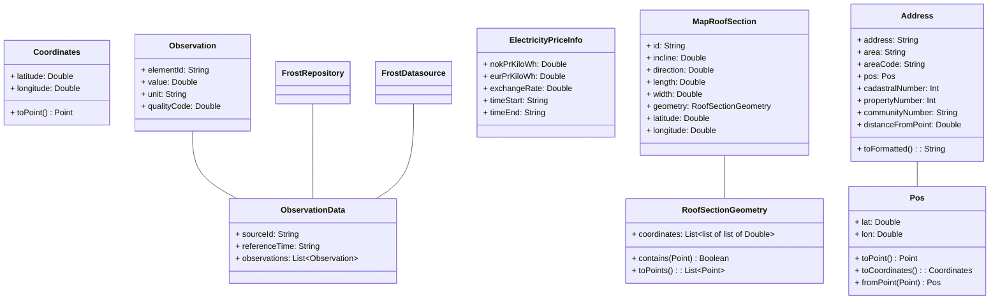
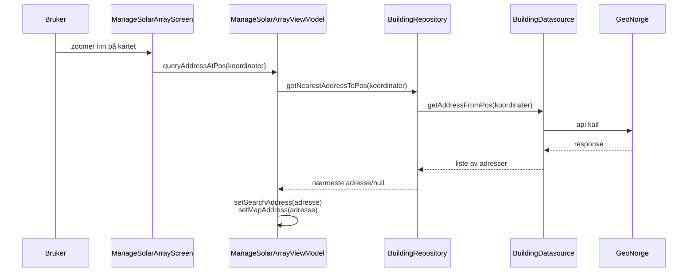

```mermaid
classDiagram
    class Coordinates {
        + latitude: Double
        + longitude: Double
        + toPoint() Point
    }

    class ObservationData {
        + sourceId: String
        + referenceTime: String
        + observations: List~Observation~
    }

    class Observation {
        + elementId: String
        + value: Double
        + unit: String
        + qualityCode: Double
    }
    
    Observation -- ObservationData
    FrostRepository -- ObservationData
    FrostDatasource -- ObservationData
    class ElectricityPriceInfo{
        + nokPrKiloWh: Double
        + eurPrKiloWh: Double
        + exchangeRate: Double
        + timeStart: String
        + timeEnd: String
    }
    
    class MapRoofSection {
        + id: String
        + incline: Double
        + direction: Double
        + length: Double
        + width: Double
        + geometry: RoofSectionGeometry
        + latitude: Double
        + longitude: Double
    }

    class RoofSectionGeometry{
        + coordinates: List~list of list of Double~
        + contains(Point) Boolean
        + toPoints(): List~Point~
    }

    class Pos {
        + lat: Double
        + lon: Double
        + toPoint() Point 
        + toCoordinates(): Coordinates 
        + fromPoint(Point) Pos 
    }

    class Address {
        + address: String
        + area: String
        + areaCode: String
        + pos: Pos
        + cadastralNumber: Int
        + propertyNumber: Int
        + communityNumber: String
        + distanceFromPoint: Double
        + toFormatted(): String 
    }

    MapRoofSection -- RoofSectionGeometry
    Address -- Pos
```

Ignored: 
- PriceData
- WeatherData
- Point is from MapBox

```mermaid
sequenceDiagram
    Bruker ->> ManageSolarArrayScreen: zoomer inn på kartet 
    
	ManageSolarArrayScreen ->> ManageSolarArrayViewModel: queryAddressAtPos(koordinater)
    ManageSolarArrayViewModel ->> BuildingRepository: getNearestAddressToPos(koordinater)
	BuildingRepository ->> BuildingDatasource: getAddressFromPos(koordinater)
	BuildingDatasource ->> GeoNorge: api kall
	
	GeoNorge -->> BuildingDatasource: response
	BuildingDatasource -->> BuildingRepository: liste av adresser
	BuildingRepository -->> ManageSolarArrayViewModel: nærmeste adresse/null
	ManageSolarArrayViewModel ->> ManageSolarArrayViewModel: setSearchAddress(adresse)<br/>setMapAddress(adresse)
```