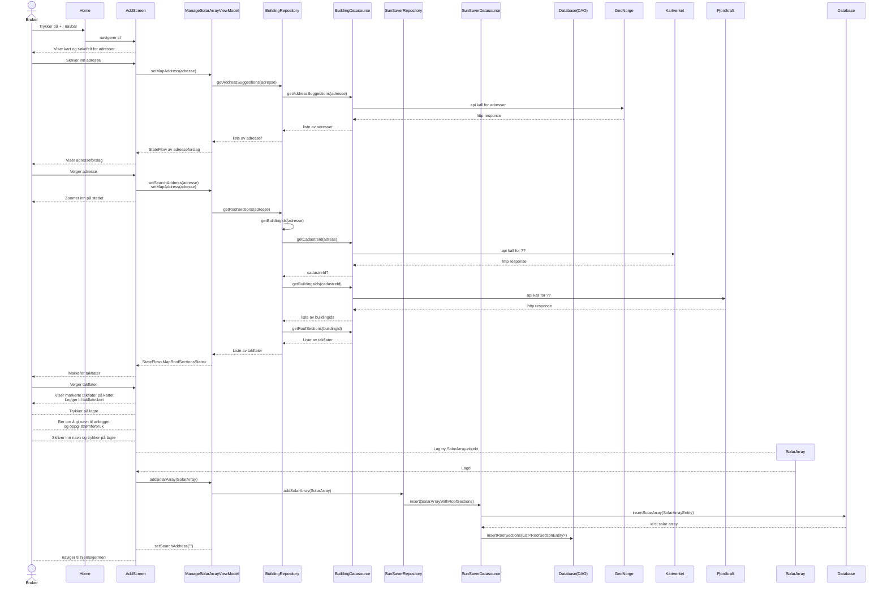

## Legge til nytt anlegg 
Preconditions: Bruker har åpnet appen. Ingen anlegg lagret.  

alt flyt: 
- bruker zoomer inn på kartet selv istedenfor å søke opp 
- bruker skal skrive inn og glemmer et felt 

alt/opt: 
- skriver inn takflateinfo 
- endrer takflate info 

Kanskje legge til at lagringen til db skjer samtidig som resten av ting på skjermen? siden det er asykron ting