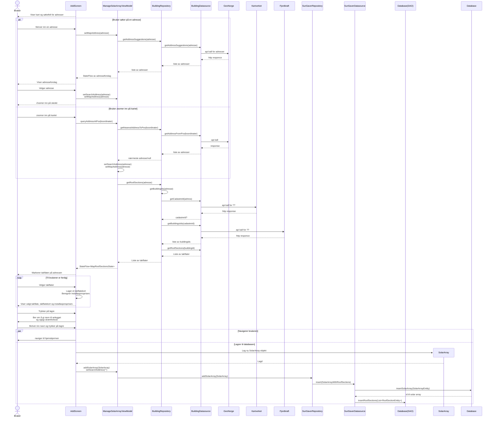

## Legge til nytt anlegg 
Preconditions: Bruker har åpnet appen. Ingen anlegg lagret.  

### Tekstlig beskrivelse: 
Pre: Brukeren har trykket på +-tegnet nede i navbaren og er nå dirigert til ManageSolarArrayScreen.  
Post: Solcelleanlegget er lagret i databasen og vises på hjemskjermen.  

1. Bruker trykker på +-tegnet nede for å legge til nytt solcelleanlegg. 
2. Bruker blir navigert til ManageSolarArrayScreen. 
3. Bruker skriver inn en adresse. 
4. Appen gjør et kall mot GeoNorge for å hente adresseforslag. 
5. Bruker velger noe fra forslagene. 
6. Appen gjør et nytt kall mot GeoNorge for å hente hele adressen. (????)
7. Brukeren blir zoomet inn på stedet. 
8. Appen gjør et kall mot Kartverket for å få cadastreId. 
9. Appen gjør et kall mot Fjordkraft for å hente takflater. 
10. Appen markerer takflater på skjermen. 
11. Bruker velger et takflate. 
12. Appen lagrer takflate som kort. Regner ut installasjonsprisen. Viser til brukeren.

  **Alternativ flyt**: Brukeren velger å zoome inn på adressen manuelt. 

3. Bruker zoomer inn på riktig adresse.  
4. Appen gjør et kall mot GeoNorge for å hente adressen. (???)  
5. Hopp til punkt 8.  

#### Forenklinger/Kommentarer
- Vi starter interaksjon med at brukeren er nettopp blitt navigert til ManageSolarArrayScreen.
- Vi sier at adresseforslag hentes kun en gang selv de egentlig hentes for hver bokstav som skriver/slettes i søkefeltet. 
- Utelatter å forklare alle steg i "appen gjør"-punktene, siden de kan sees i detalj på sekvensdiagrammet. 
- Valideringer/div. brukerinteraksjon etter at adressen er satt skal vises i aktivitetsdiagrammet. Dette er fordi det er lite givende å ha det i sekvensdigrammet, da det er kun interaksjon mellom bruker og ManageSolarArrayScreen-skjermen. 