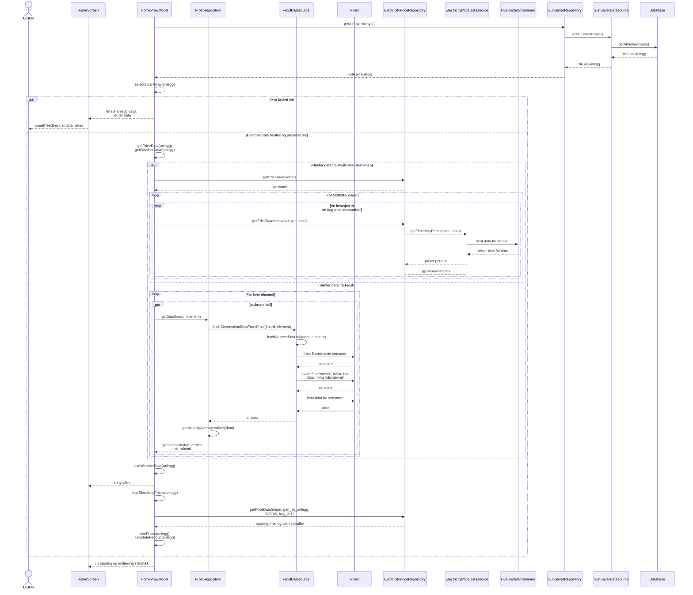

## Se lagrede anlegg og velg et annet anlegg
Vi slår sammen sekvensdiagrammene for disse to use cases fordi flyten i de er ganske lik, så det er logisk å slå disse to sammen.  
Blant det vi ønsker å vise med dette sekvensdiagrammet, er at hvis man trykker på et anlegg som har statistikk lastet opp, så vil det ikke lastes opp ijgen. Det som vi derimot ikke viser, men er viktig her, er at hvis man trykker på et anlegg som har tidligere feilet, vil det prøve å laste data opp på nytt. 

### Tekstlig beskrivelse: 
Pre: Bruker har minst to lagrede anlegg. Bruker går inn på appen.  
Post: Bruker fikk sett på anleggene sine.  
1. Appen henter lagrede anlegg fra databasen og viser dem på HomeScreen. 
2. Mens data hentes, vises "laster" animasjonen. 
3. Det første anlegget er automatisk i fokus. 
4. Appen henter data fra Frost og HvaKosterStrømen og viser det i form av Sparing-, Strømproduksjon og Inntjenning-komponentene. 
5. Bruker velger en annen solcelleanlegg. 
6. Appen henter data fra Frost og HvaKosterStrømen og viser det i form av Sparing-, Strømproduksjon og Inntjenning-komponentene for dette anlegget.
7. Bruker trykker igjen på det første anlegget. 
8. Appen viser statistikken for dette anlegget uten noen ekstra kall til API-ene. 

 **Alternativ flyt**:. 
Bruker prøver å velge et anlegg mens data lastes.  
Bruker klikker seg rundt i Sparing-boksen.  
Greier ikke å hente data fra frost 

#### Forenklinger/Kommentarer
- Bruker "koord" for "koordinater" for å spare litt plass
- He