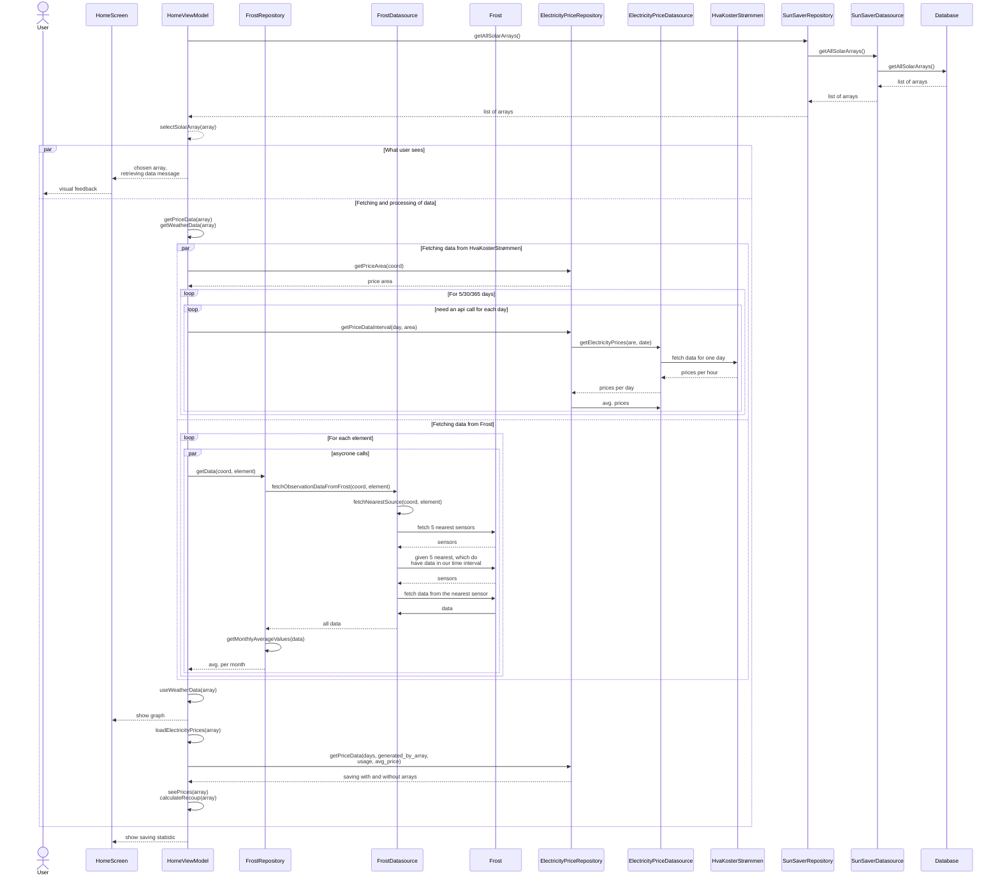

## Se lagret anlegg

### Tekstlig beskrivelse: 
Pre: Bruker har minst et lagret anlegg. Bruker går inn på appen.  
Post: Bruker fikk sett statistikk for sin anlegg.  
1. Appen henter lagrede anlegg fra databasen og viser dem på HomeScreen. 
2. Mens data hentes, vises "laster" animasjonen. 
3. Det første anlegget er automatisk i fokus. 
4. Appen henter data fra Frost og HvaKosterStrømen og viser det i form av Sparing-, Strømproduksjon og Inntjenning-komponentene. 
5. Bruker velger en annen solcelleanlegg. 
6. Appen henter data fra Frost og HvaKosterStrømen og viser det i form av Sparing-, Strømproduksjon og Inntjenning-komponentene for dette anlegget.
7. Bruker trykker igjen på det første anlegget. 
8. Appen viser statistikken for dette anlegget uten noen ekstra kall til API-ene. 

 **Alternativ flyt**:. 
Bruker prøver å velge et anlegg mens data lastes.  
Bruker klikker seg rundt i Sparing-boksen.  
Greier ikke å hente data fra frost 

#### Forenklinger/Kommentarer
- Bruker "koord" for "koordinater" for å spare litt plass
- Flyten her er ganske komplisert, så her kommer det en ekstra forklaring: bla bla