```mermaid
classDiagram

    class Coordinates ::: dataclass {
        + latitude: Double
        + longitude: Double
        + toPoint() Point
    }
    note for Coordinates "Also used in Frost Data Layer, ElectricityPriceRepository <br/> and Pos. Relations not included for better readablity"

    class SolarPanelType ::: dataclass {
        <<Enumeration>>
        + displayName: String
        + watt: Int
        - price: Double
        - installationPrice: Double
        + length: Double
        + width: Double
        + totalPrice(Int) Double
        + nameWithWatt() String
        + area() Double
    }
    note for SolarPanelType "Economy<br/>Performance<br/>Premium"

    class SolarArray ::: dataclass {
        + id: Long
        + name: String
        + panelType: SolarPanelType
        + roofSections: RoofSection
        + coordinates: Coordinates
        + powerConsumption: Double
        + address: String
    }

    class RoofSection  ::: dataclass {
        + id: Long?
        + area: Double
        + incline: Double
        + direction: Double
        + panels: Int
        + mapId: String?
    }
 
    %% HomeViewModel
    class NetworkObserver {
        + isConnected: Flow~Boolean~
        - connectivityManager: ConnectivityManager
        + isNetworkAvailable() Boolean
    }
    
    class Elements ::: dataclass {
        <<Enumeration>>
        +TEMP
        + CLOUD
        + SNOW
        + IRRIDANCE
        + SUNHOURS
    }

    class HomeUiState ::: dataclass {
        + solarArrays: List~SolarArray~ 
        + selectedSolarArray: SolarArray? 
        + priceData: PriceData 
        + electricityProductionData: Map~String, list of Double~
        + timeScope: TimeScope
        + timeUntilRecoup: Double 
    }

    class LoadingState ::: dataclass {
        + isLoading: Boolean 
        + statusMessage: String
    }

    class TimeScope ::: dataclass {
        <<Enumeration>>
        + DAY 
        + MONTH
        + YEAR
    }

    class PriceData ::: dataclass {
        + realPrice: Double
        + solarPrice: Double
        + saved: Double
    }

    class WeatherData ::: dataclass {
        + temp: Map~String, Double~
        + cloud: Map~String, Double~
        + snow: Map~String, Double~
        + irradiance: Map~String, Double~
        + sunhours: Map~String, Double~ 
    }

    class HomeViewModel {
        - networkObserver: NetworkObserver
        - _repository: FrostRepository
        - _sunSaverRepository: SunSaverRepository
        - electricityPriceRepository: ElectricityPriceRepository

        - _priceLoadingState: MutableStateFlow~LoadingState~
        + priceLoadingState: StateFlow~LoadingState~

        - _graphLoadingState: MutableStateFlow~LoadingState~
        + graphLoadingState: StateFlow~LoadingState~

        - _homeUiState: MutableStateFlow~HomeUiState~
        + homeUiState: StateFlow~HomeUiState~

        - _snackbarMessage: MutableSharedFlow~String~
        + snackbarMessage: SharedFlow~String~

        - _isOnline: MutableStateFlow~Boolean~
        + isOnline: StateFlow~Boolean~

        - electricityProductionMap: MutableMap~SolarArray, list of Double~
        - electricityPriceMap: MutableMap~SolarArray, MutableMap of TimeScope and PriceData~
        - weatherDataMap: MutableMap~SolarArray, WeatherData~
        - priceDataMap: MutableMap~SolarArray, MutableMap of TimeScope and Double~
        - timeScopeToDays: Map~TimeScope, Int~

        + selectSolarArray(SolarArray, Boolean?)
        - observeNetwork()
        - getWeatherData(SolarArray)
        - useWeatherData(SolarArray)
        - getPriceData(SolarArray)
        + removeSolarArray(SolarArray)
        - loadElectricityPrices(SolarArray)
        - seePrices(TimeScope, SolarArray)
        + changeTimeScope(TimeScope)
        - calculateRecoup(SolarArray)
        - findUpdated(List~SolarArray~, List~SolarArray~) SolarArray?
    }
    
    %% Frost: Classes 
    class FrostRepository {
        - datasource: FrostDatasource
        + getData(Coordinates, Elements) Map~String, Double~
        - getMonthlyAverageValues(List~ObservationData~) Map~String, Double~
    }

    class FrostDatasource {
        - client: HttpClient
        - raw: String
        - encoded: String
        - authHeader: String
        - nameMap: Map~Elements, String~
        - sensorMap: MutableMap~Elements, mutable list of String~
        - referenceTome: String
        - fetchNearestSource(Coordinates, Elements) MutableMap~Elements, list of String~
        + fetchObservationDataFromFrost(Coordinates, Elements) List~ObservationData~
    } 

    class ObservationData ::: dataclass {
        + sourceId: String
        + referenceTime: String
        + observations: List~Observation~
    }

    class Observation ::: dataclass {
        + elementId: String
        + value: Double
        + unit: String
        + qualityCode: Double
    }

    class AvailableObservation ::: dataclass {
        + sourceId: String
        + validFrom: String
        + timeOffset: String
        + timeResolution: String
        + timeSeriesId: Int
        + elementId: String
        + unit: String
    }

    class SensorSystem ::: dataclass {
        + id: String
        + name: String
        + shortName: String
        + geometry: SystemGeometry
        + distance: Double
        + validFrom: String
    }

    class SystemGeometry ::: dataclass {
        + coordinates: List~Double~
        + nearest: Boolean
    }

    %% ElectricityPrice
    class ElectricityPriceRepository {
        - datasource: ElectricityPriceDataSource
        + getPriceData(Int, Double, Double, Double) List~Double~
        + getMonth() Int
        + getPriceDataInterval(Int, String) List~Double~
        - decrementDate(String) String
        + getPriceAreal(Coordinates) String

    }
    
    class ElectricityPriceDataSource {
        - client: HttpClient
        + getElectricityPrices(String, String) List~ElectricityPriceInfo~
    }

    class ElectricityPriceInfo  ::: dataclass{
        + nokPrKiloWh: Double
        + eurPrKiloWh: Double
        + exchangeRate: Double
        + timeStart: String
        + timeEnd: String
    }
    

    %% SunSaver
    class ISunSaverRepository {
        <<Interface>>
        + getAllSolarArrays() Flow~list of SolarArray~
        + addSolarArray(SolarArray)
        + deleteSolarArray(SolarArray)
        + updateSolarArray(SolarArray)
    }
    class SunSaverRepository {
        - datasource: ISunSaverDatasource
        + getAllSolarArrays() Flow~list of SolarArray~
        + addSolarArray(SolarArray)
        + deleteSolarArray(SolarArray)
        + updateSolarArray(SolarArray)
    }

    class SunSaverDatasource {
        - sunSaverDao: SunSaverDao 
        + insert(SolarArrayWithRoofSections) Long
        + getAllSolarArrays(): Flow~list of SolarArrayWithRoofSections~
        + delete(SolarArrayWithRoofSections)
        + update(SolarArrayWithRoofSections)
    }
    class ISunSaverDatasource {
        <<Interface>>
        + insert(SolarArrayWithRoofSections) Long
        + getAllSolarArrays(): Flow~list of SolarArrayWithRoofSections~
        + delete(SolarArrayWithRoofSections)
        + update(SolarArrayWithRoofSections)
    }    
    class SolarArrayWithRoofSections ::: dataclass {
        + solarArray: SolarArrayEntity
        + roofSections: List~RoofSectionEntity~
    }

    %% Database part
    class SunSaverDao {
        <<Interface>>
        + insertSolarArray(SolarArrayEntity) Long
        + insertRoofSections(List~RoofSectionEntity~)
        + getAllSolarArrays() Flow~ list of SolarArrayWithRoofSections~
        + delete(SolarArrayEntity)
        + updateSolarArray(SolarArrayEntity)
        + updateRoofSections(List~RoofSectionEntity~)
        + deleteRoofSections(List~RoofSectionEntity~)
        + getRoofSectionBySolarArrayId(Long) List~RoofSectionEntity~
    }

    
    class SunSaverDatabase {
        <<Abstract>>
        + sunSaverDao() SunSaverDao
    }
    class RoomDatabase {
    }

 
    class SolarArrayEntity ::: dataclass {
        + id: Long
        + name: String
        + panelType: String
        + latitude: Double
        + longitude: Double
        + powerConsumption: Double
        + address: String
    }
    class RoofSectionEntity ::: dataclass {
        + roofSectionId: Long
        + solarArrayId: Long
        + area: Double
        + incline: Double
        + direction: Double
        + panels: Int
        + mapId: String
    }
    
    namespace Database {
        class SolarArrayEntity
        class RoofSectionEntity 
        class RoomDatabase
        class SunSaverDatabase
        class SunSaverDao
    }

    
    class MapRoofSection ::: dataclass {
        + id: String
        + incline: Double
        + direction: Double
        + length: Double
        + width: Double
        + geometry: RoofSectionGeometry
        + latitude: Double
        + longitude: Double
    }

    class RoofSectionGeometry ::: dataclass {
        + coordinates: List~list of list of Double~
        + contains(Point) Boolean
        + toPoints() List~Point~
    }

    class Pos ::: dataclass {
        + lat: Double
        + lon: Double
        + toPoint() Point 
        + toCoordinates() Coordinates 
        + fromPoint(Point) Pos 
    }

    class Address ::: dataclass {
        + address: String
        + area: String
        + areaCode: String
        + pos: Pos
        + cadastralNumber: Int
        + propertyNumber: Int
        + communityNumber: String
        + distanceFromPoint: Double
        + toFormatted() String 
    }

    class AddressState ::: dataclass {
        + address: Address
    }
    
    class MapRoofSectionsState ::: dataclass {
        + roofSections: List~MapRoofSection~
        + isError: Boolean
    }

    class SearchAddressState ::: dataclass {
        + query: String
    }

    class AddressSuggestionsState ::: dataclass {
        + suggestions: List~Address~
    }

    class ManageSolarArrayViewModel {
        - repository: BuildingRepository
        - _sunSaverRepository: SunSaverRepository

        - _currentSolarArray: MutableStateFlow~SolarArray~
        + currentSolarArray: StateFlow~SolarArray~

        - _mapAddress: MutableStateFlow~AddressState~
        + mapAddress: StateFlow~AddressState~

        - _mapSearchAddress: MutableStateFlow~SearchAddressState~
        + mapAddress: StateFlow~SearchAddressState~
        
        + mapRoofSections: StateFlow~MapRoofSectionsState~
        + mapSearchAddressSuggestions: StateFlow~AddressSuggestionsState~
        
        + setMapAddress(Address)
        + setSearchAddress(String)
        + updateSolarArrayAddress(SolarArray?)
        + addSolarArray(SolarArray)
        + queryAddressAtPos(Pos)
        + updateSolarArray(SolarArray)
        + getSolarArray(Long)
        + resetUpdSolarArray()
    }

    %% Building 
    class BuildingRepository {
        - dataSource: BuildingDataSource
        + getAddressSuggestions(String) List~Address~
        + getNearestAddressToPos(Pos) Address? 
        + getRoofSections(Address) List~MapRoofSections~
        - getBuildingIds(Address) List~String~
    }

    class BuildingDataSource {
        - client: HttpClient
        + getAddressSuggestions(String) List~Address~
        + getAddressFromPos(Pos) List~Address~
        + getCadastreId(Address) Long? 
        + getBuildingIds(Long) List~String~
        + getRoofSections(String) List~MapRoofSections~
    }
    %% relations 

    SolarPanelType -- SolarArray
    RoofSection "1..*" --* "1" SolarArray : roofsections
    Coordinates -- SolarArray
    SolarArray -- HomeViewModel
    SolarArray -- ISunSaverRepository
    SolarArray -- ManageSolarArrayViewModel

    TimeScope -- HomeUiState
    HomeUiState -- HomeViewModel
    
    TimeScope -- HomeViewModel
    PriceData -- HomeViewModel
    WeatherData -- HomeViewModel
    LoadingState -- HomeViewModel    
    NetworkObserver -- HomeViewModel
    HomeViewModel -- Elements
    
    %% Frost 
    ObservationData -- Observation
    FrostRepository --> FrostDatasource: fetcher værdata (snø, skydekke, temperatur, flux, soltimer)
    HomeViewModel --> FrostRepository: fetcher gjennomsnittlige verdier av værdata

    FrostRepository -- Elements
    FrostRepository -- ObservationData
 
    FrostDatasource -- Elements
    FrostDatasource -- AvailableObservation
    FrostDatasource -- SensorSystem
    SensorSystem -- SystemGeometry
    
    FrostDatasource -- ObservationData
    %% electrisity prices

    HomeViewModel --> ElectricityPriceRepository: gjennomsnittlig strømpris gitt tidsintervall
    ElectricityPriceRepository --> ElectricityPriceDataSource: fetcher NOK per kWn per dag
    
    %% ElectricityPriceInfo -- ElectricityPriceRepository
    ElectricityPriceDataSource -- ElectricityPriceInfo
    
    %% db 
    ISunSaverRepository <|.. SunSaverRepository
    SunSaverRepository -- ISunSaverDatasource: lagrer og henter data
    
    ISunSaverDatasource <|.. SunSaverDatasource
    ISunSaverDatasource -- SolarArrayWithRoofSections
    SunSaverDatasource -- SunSaverDao
    SunSaverDatabase --|> RoomDatabase
    SunSaverDao -- SunSaverDatabase
    SolarArrayWithRoofSections -- SunSaverDao
    SunSaverDao -- SolarArrayEntity
    
    SunSaverDatabase -- RoofSectionEntity: tabell     
    SunSaverDatabase -- SolarArrayEntity: tabell

    
    SolarArrayEntity "1" *-- "1..*" RoofSectionEntity
    SolarArrayWithRoofSections "1" -- "1" SolarArrayEntity
    
    
    ManageSolarArrayViewModel -- ISunSaverRepository: lagrer og henter data
    HomeViewModel -- ISunSaverRepository: lagrer og henter data
    SearchAddressState -- ManageSolarArrayViewModel
   

    ManageSolarArrayViewModel -- AddressState
    ManageSolarArrayViewModel -- AddressSuggestionsState
        

    ManageSolarArrayViewModel -- MapRoofSectionsState

    
    BuildingDataSource -- MapRoofSection 
    BuildingRepository -- MapRoofSection 
    ManageSolarArrayViewModel -- MapRoofSection 

    MapRoofSectionsState -- MapRoofSection
    AddressState -- Address
    AddressSuggestionsState -- Address

    ManageSolarArrayViewModel --> BuildingRepository: fetcher adressedata med bygningsdata
    BuildingRepository --> BuildingDataSource: fetcher data om takflater, koordinater og adresser

    MapRoofSection -- RoofSectionGeometry
    Address -- Pos
    ManageSolarArrayViewModel -- Pos
    BuildingRepository -- Pos
        
    BuildingDataSource -- Pos

    ManageSolarArrayViewModel -- Address
    BuildingRepository -- Address    
    BuildingDataSource -- Address



    classDef dataclass fill:#520c0c,color:white
```

- We chose not to include the smaller classes that are only used internally in the functions, like classes that are only for serialization of api responces (e.g. classes used in Frost-part to get sensor data)
- We chose not to draw relation between Coordinates and FrostRepository, FrostDatasource and ElectrisityRepository and Pos. The decision was made because it is a trade off between readability and correctness. In this particular case, the diagram will because too messy if we include those relations.

Coordinates: 
- Frost repository 
- FrostDatasource
- ElectrisityPriceRepository 